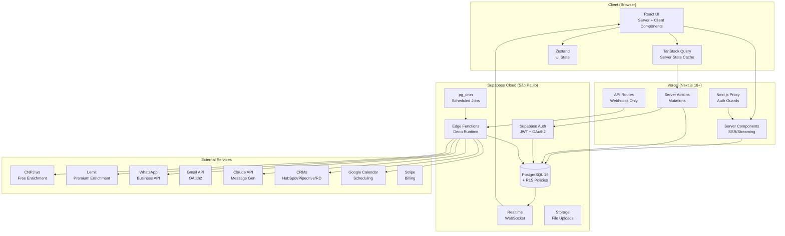
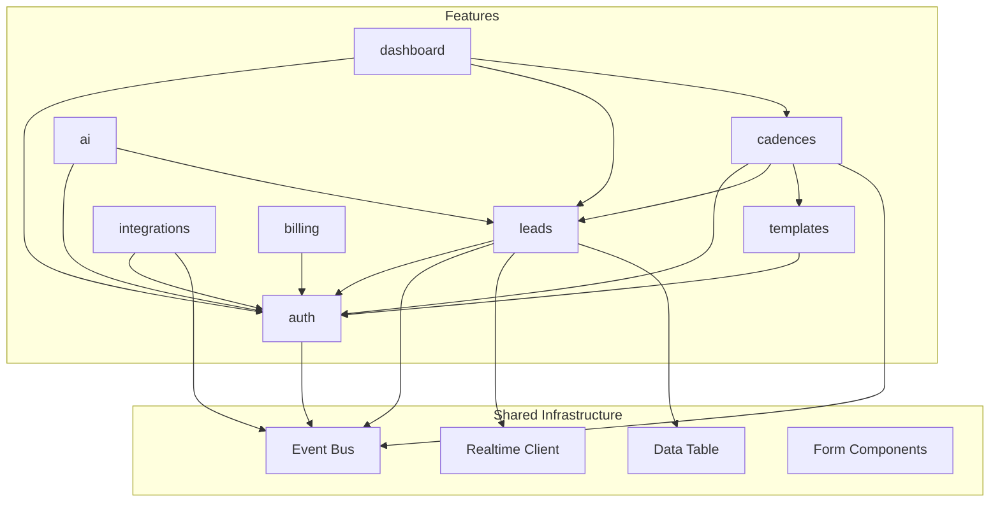
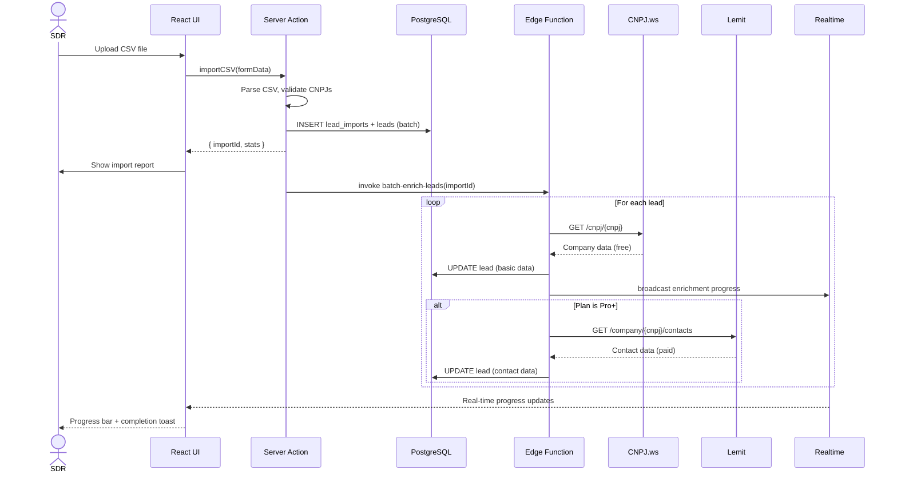
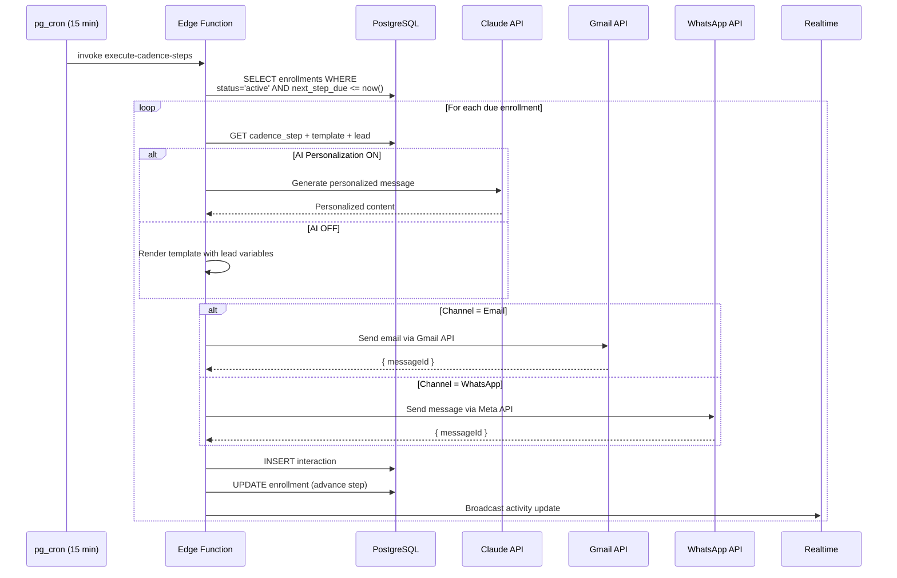
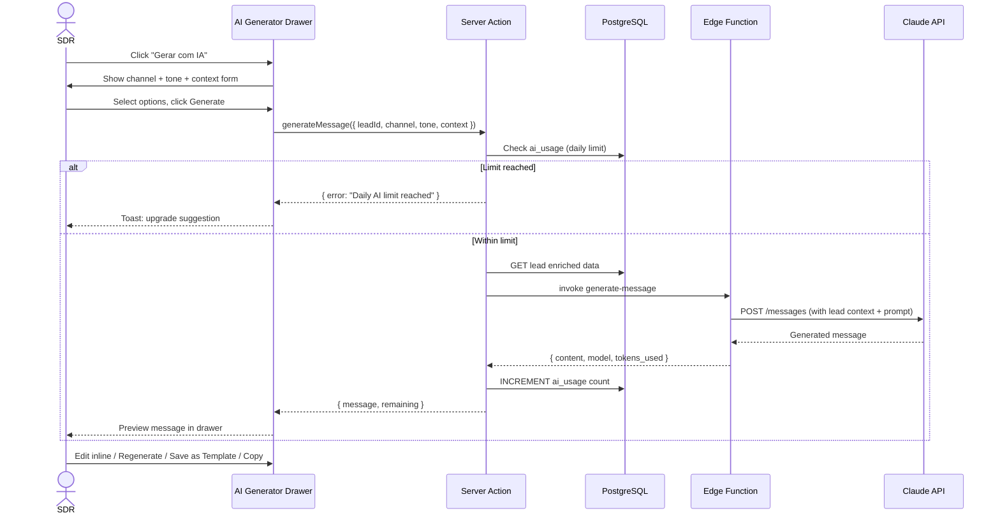
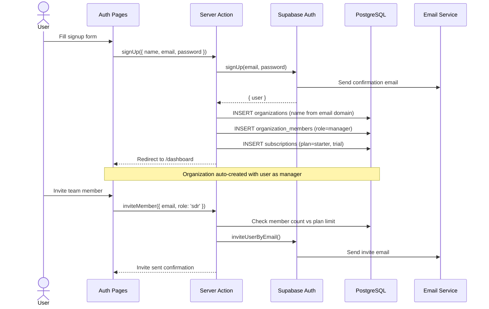
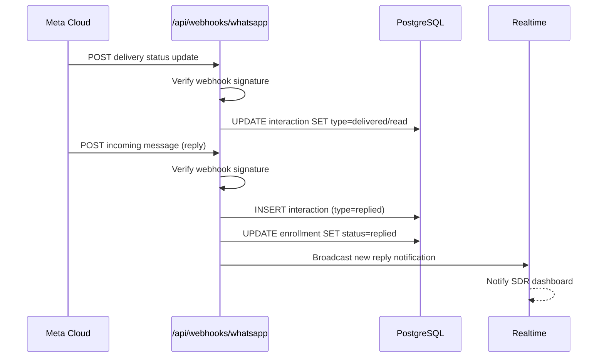
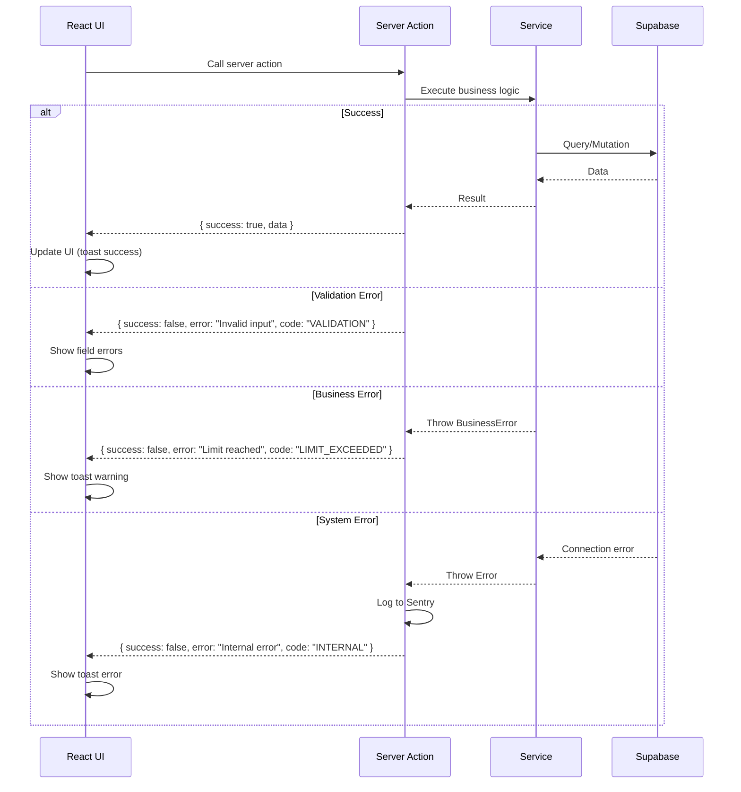

# Flux Sales Engagement 2.0 — Architecture Document

> **Version:** 1.0 | **Date:** 2026-02-19 | **Author:** Aria (Architect)
> **Status:** Draft | **Preset:** nextjs-react v1.0.0

---

## Table of Contents

1. [Introduction](#1-introduction)
2. [High Level Architecture](#2-high-level-architecture)
3. [Tech Stack](#3-tech-stack)
4. [Data Models](#4-data-models)
5. [API Specification](#5-api-specification)
6. [Feature Modules & Components](#6-feature-modules--components)
7. [External APIs & Integrations](#7-external-apis--integrations)
8. [Core Workflows](#8-core-workflows)
9. [Database Schema](#9-database-schema)
10. [Frontend Architecture](#10-frontend-architecture)
11. [Backend Architecture](#11-backend-architecture)
12. [Unified Project Structure](#12-unified-project-structure)
13. [Development Workflow](#13-development-workflow)
14. [Deployment Architecture](#14-deployment-architecture)
15. [Security & Performance](#15-security--performance)
16. [Testing Strategy](#16-testing-strategy)
17. [Coding Standards](#17-coding-standards)
18. [Error Handling Strategy](#18-error-handling-strategy)
19. [Monitoring & Observability](#19-monitoring--observability)
20. [Checklist Results Report](#20-checklist-results-report)

---

## 1. Introduction

### Project Overview

**Flux Sales Engagement 2.0** é uma plataforma brasileira de sales engagement focada em SDRs/BDRs de empresas B2B (Startups, PMEs e Mid-market). A plataforma combina enriquecimento automático de leads via CNPJ, geração de mensagens com IA (Claude API), cadências omnichannel (WhatsApp + Email) e integrações com CRMs existentes.

### Project Type

- **Type:** Greenfield (novo projeto, sem código legado)
- **Starter Template:** Nenhum — projeto inicializado do zero
- **Pattern Guide:** Tech preset `nextjs-react` v1.0.0 (5 Essential Patterns)

### Scope

- **PRD:** [`docs/prd.md`](../prd.md) — 5 épicos, 25 stories, 13 FRs, 10 NFRs
- **Frontend Spec:** [`docs/architecture/frontend-spec.md`](./frontend-spec.md) — UX goals, wireframes, design system
- **Target:** MVP com 5 épicos sequenciais entregando valor incremental

### Key References

| Document | Path | Description |
|----------|------|-------------|
| PRD | `docs/prd.md` | Product requirements (5 epics, 25 stories) |
| PRD Shards | `docs/prd/` | PRD sections individuais |
| Frontend Spec | `docs/architecture/frontend-spec.md` | UX/UI specification |
| Tech Preset | `.aios-core/data/tech-presets/nextjs-react.md` | Architecture patterns |

---

## 2. High Level Architecture

### Technical Summary

Flux é uma aplicação web fullstack construída com **Next.js 16+** (App Router) hospedada na **Vercel**, utilizando **Supabase Cloud** como Backend-as-a-Service (BaaS). A arquitetura elimina a necessidade de um servidor backend tradicional — toda a lógica de negócio roda via Server Actions (mutações), API Routes (webhooks), e Edge Functions (processamento assíncrono).

### Architecture Style

**Monolith com BaaS** — Uma única aplicação Next.js que consome Supabase como infraestrutura de backend. Essa abordagem combina a simplicidade de um monolith com a escalabilidade e features prontas do Supabase (Auth, PostgreSQL + RLS, Edge Functions, Realtime, Storage).

### Platform Choice

| Aspecto | Vercel + Supabase | Railway + Postgres | AWS (ECS/Lambda) |
|---------|:-:|:-:|:-:|
| Complexidade de Setup | Baixa | Média | Alta |
| Custo Inicial (MVP) | $0-25/mês | $5-20/mês | $50-100/mês |
| Auth Integrado | Supabase Auth | Precisa implementar | Cognito (complexo) |
| RLS Nativo | PostgreSQL RLS | Manual | Manual |
| Edge Functions | Supabase (Deno) | Não tem | Lambda |
| Realtime | Supabase Realtime | Socket.io manual | AppSync |
| Região São Paulo | Vercel Edge + Supabase SA | Railway SA | AWS SA |
| DX / Velocidade Dev | Excelente | Boa | Média |

**Decisão:** Vercel + Supabase Cloud (região São Paulo) — máxima velocidade de desenvolvimento com custo mínimo para MVP.

### Architecture Diagram



### Architectural Patterns

| # | Pattern | Purpose | Implementation |
|---|---------|---------|----------------|
| 1 | **Contract Pattern** | APIs públicas entre features | `*.contract.ts` files |
| 2 | **Service Pattern** | Encapsular lógica de negócio | `*.service.ts` classes |
| 3 | **Repository Pattern** | Isolar acesso a dados | `*.repository.ts` via Supabase client |
| 4 | **Event Bus Pattern** | Comunicação desacoplada entre features | `EventBus` class in `shared/events/` |
| 5 | **Builder Pattern** | Test fixtures | `*.builder.ts` em `test/builders/` |
| 6 | **Multi-tenant RLS** | Isolamento de dados por organização | PostgreSQL RLS + `auth.user_org_id()` |
| 7 | **Server Action Pattern** | Mutations type-safe | `ActionResult<T>` response type |
| 8 | **Edge Function Pattern** | Processamento assíncrono | Supabase Edge Functions (Deno) |
| 9 | **Feature-Based Architecture** | Organização de código | `/src/features/{name}/` com contracts |

---

## 3. Tech Stack

### Core Framework

| Category | Technology | Version | Rationale |
|----------|-----------|---------|-----------|
| **Framework** | Next.js | ^16.0.0 | App Router + Proxy (substitui middleware), Server Components, Server Actions |
| **Language** | TypeScript | ^5.7.0 | Strict mode, type safety across stack |
| **Runtime** | Node.js | ^22.0.0 | LTS, required by Next.js 16 |
| **React** | React | ^19.0.0 | Server Components, Suspense, use() hook |

### Backend-as-a-Service

| Category | Technology | Version | Rationale |
|----------|-----------|---------|-----------|
| **BaaS** | Supabase | Cloud | Auth + PostgreSQL + Edge Functions + Realtime + Storage |
| **Database** | PostgreSQL | 15 | RLS nativo, pg_cron, GIN indexes, JSONB |
| **Auth** | Supabase Auth | - | JWT, OAuth2 (Google), magic links |
| **Edge Functions** | Deno Runtime | - | Async processing (enrichment, cadence execution) |
| **Realtime** | Supabase Realtime | - | WebSocket para dashboard updates |
| **Storage** | Supabase Storage | - | CSV uploads, attachments |
| **CLI** | Supabase CLI | ^2.0.0 | Local dev, migrations, seed |

### Frontend

| Category | Technology | Version | Rationale |
|----------|-----------|---------|-----------|
| **Styling** | Tailwind CSS | ^4.0.0 | Oxide engine, CSS-first config, zero-runtime |
| **UI Components** | shadcn/ui | latest | Acessível, customizável, não é dependência |
| **Icons** | Lucide React | ^0.460.0 | Outline style, tree-shakeable |
| **State (Server)** | TanStack Query | ^5.60.0 | Server state cache, optimistic updates |
| **State (UI)** | Zustand | ^5.0.0 | Minimal global UI state |
| **Forms** | React Hook Form | ^7.54.0 | Performant, uncontrolled by default |
| **Validation** | Zod | ^3.24.0 | Schema validation, shared FE/BE |
| **Charts** | Recharts | ^2.13.0 | Reports & dashboard visualizations |
| **Tables** | TanStack Table | ^8.20.0 | Sorting, filtering, pagination |
| **Drag & Drop** | @dnd-kit | ^6.1.0 | Cadence step reordering |
| **Fonts** | Inter + JetBrains Mono | Variable | UI text + CNPJ/data display |

### Testing

| Category | Technology | Version | Rationale |
|----------|-----------|---------|-----------|
| **Unit/Integration** | Vitest | ^2.1.0 | Fast, ESM native, Jest-compatible API |
| **Component** | Testing Library | ^16.1.0 | User-centric component testing |
| **E2E** | Playwright | ^1.49.0 | Cross-browser, reliable |
| **Mocking** | MSW | ^2.6.0 | Network-level API mocking |
| **Coverage** | v8 (via Vitest) | - | Code coverage reports |

### DevOps & Tooling

| Category | Technology | Version | Rationale |
|----------|-----------|---------|-----------|
| **Hosting** | Vercel | - | Zero-config Next.js deploy, Edge network |
| **CI/CD** | GitHub Actions | - | Automated testing, deploy |
| **Linting** | ESLint | ^9.0.0 | Flat config, next/core-web-vitals |
| **Formatting** | Prettier | ^3.4.0 | Consistent code style |
| **Error Tracking** | Sentry | ^8.0.0 | Error monitoring, performance |
| **Package Manager** | pnpm | ^9.0.0 | Fast, disk-efficient |

### Why NOT Prisma?

O tech preset sugere Prisma como ORM, mas para Supabase a decisão é usar o **Supabase Client diretamente** com Repository Pattern:

| Aspecto | Prisma | Supabase Client |
|---------|--------|-----------------|
| Type Safety | Gerado via schema | TypeScript gerado via CLI (`supabase gen types`) |
| RLS Support | Não respeita RLS | Respeita RLS nativamente |
| Auth Integration | Requer adapter | Integrado via cookies/JWT |
| Edge Functions | Não roda em Deno | Roda nativamente |
| Realtime | Não tem | Supabase Realtime integrado |
| Setup Overhead | prisma generate, migrations separadas | CLI integrado, migrations via SQL |

---

## 4. Data Models

### Entity Relationship Diagram

```mermaid
erDiagram
    organizations ||--o{ organization_members : "has"
    organizations ||--o{ leads : "owns"
    organizations ||--o{ cadences : "owns"
    organizations ||--o{ message_templates : "owns"
    organizations ||--o{ crm_connections : "has"
    organizations ||--|{ subscriptions : "has"
    organizations ||--o{ gmail_connections : "has"
    organizations ||--o| whatsapp_connections : "has"
    organizations ||--o{ calendar_connections : "has"

    organization_members }o--|| users : "is"

    leads ||--o{ interactions : "has"
    leads ||--o{ cadence_enrollments : "enrolled in"
    leads }o--o| lead_imports : "imported via"
    leads ||--o{ enrichment_attempts : "enriched via"

    lead_imports ||--o{ lead_import_errors : "has"

    cadences ||--o{ cadence_steps : "has"
    cadences ||--o{ cadence_enrollments : "enrolls"

    cadence_steps }o--o| message_templates : "uses"

    cadence_enrollments ||--o{ interactions : "generates"

    crm_connections ||--o{ crm_sync_log : "logs"

    subscriptions }o--|| plans : "subscribes to"
    organizations ||--o{ ai_usage : "tracks"
    organizations ||--o{ whatsapp_credits : "tracks"

    organizations {
        uuid id PK
        text name
        text slug UK
        uuid owner_id FK
        timestamp created_at
        timestamp updated_at
    }

    users {
        uuid id PK
        text email UK
        text name
        text avatar_url
        timestamp created_at
    }

    organization_members {
        uuid id PK
        uuid org_id FK
        uuid user_id FK
        member_role role
        member_status status
        timestamp invited_at
        timestamp accepted_at
        timestamp updated_at
    }

    leads {
        uuid id PK
        uuid org_id FK
        text cnpj
        lead_status status
        enrichment_status enrichment_status
        text razao_social
        text nome_fantasia
        jsonb endereco
        text porte
        text cnae
        text situacao_cadastral
        text email
        text telefone
        jsonb socios
        numeric faturamento_estimado
        timestamp enriched_at
        uuid created_by FK
        uuid import_id FK
        timestamp deleted_at
        timestamp created_at
        timestamp updated_at
    }

    lead_imports {
        uuid id PK
        uuid org_id FK
        text file_name
        integer total_rows
        integer processed_rows
        integer success_count
        integer error_count
        import_status status
        uuid created_by FK
        timestamp created_at
    }

    lead_import_errors {
        uuid id PK
        uuid import_id FK
        integer row_number
        text cnpj
        text error_message
        timestamp created_at
    }

    enrichment_attempts {
        uuid id PK
        uuid lead_id FK
        text provider
        enrichment_status status
        jsonb response_data
        text error_message
        integer duration_ms
        timestamp created_at
    }

    cadences {
        uuid id PK
        uuid org_id FK
        text name
        text description
        cadence_status status
        integer total_steps
        uuid created_by FK
        timestamp deleted_at
        timestamp created_at
        timestamp updated_at
    }

    cadence_steps {
        uuid id PK
        uuid cadence_id FK
        integer step_order
        channel_type channel
        uuid template_id FK
        integer delay_days
        integer delay_hours
        boolean ai_personalization
        timestamp created_at
    }

    cadence_enrollments {
        uuid id PK
        uuid cadence_id FK
        uuid lead_id FK
        integer current_step
        enrollment_status status
        timestamp next_step_due
        uuid enrolled_by FK
        timestamp enrolled_at
        timestamp completed_at
        timestamp updated_at
    }

    message_templates {
        uuid id PK
        uuid org_id FK
        text name
        channel_type channel
        text subject
        text body
        text[] variables_used
        boolean is_system
        uuid created_by FK
        timestamp created_at
        timestamp updated_at
    }

    interactions {
        uuid id PK
        uuid org_id FK
        uuid lead_id FK
        uuid cadence_id FK
        uuid step_id FK
        channel_type channel
        interaction_type type
        text message_content
        text external_id
        jsonb metadata
        boolean ai_generated
        uuid original_template_id FK
        timestamp created_at
    }

    crm_connections {
        uuid id PK
        uuid org_id FK
        crm_type crm_provider
        jsonb credentials_encrypted
        jsonb field_mapping
        connection_status status
        timestamp last_sync_at
        timestamp created_at
        timestamp updated_at
    }

    crm_sync_log {
        uuid id PK
        uuid connection_id FK
        sync_direction direction
        integer records_synced
        integer errors
        integer duration_ms
        jsonb error_details
        timestamp created_at
    }

    plans {
        uuid id PK
        text name
        text slug UK
        integer price_cents
        integer max_leads
        integer max_ai_per_day
        integer max_whatsapp_per_month
        integer included_users
        integer additional_user_price_cents
        jsonb features
        boolean active
        timestamp created_at
        timestamp updated_at
    }

    subscriptions {
        uuid id PK
        uuid org_id FK
        uuid plan_id FK
        subscription_status status
        timestamp current_period_start
        timestamp current_period_end
        text stripe_subscription_id
        timestamp created_at
        timestamp updated_at
    }

    ai_usage {
        uuid id PK
        uuid org_id FK
        date usage_date
        integer generation_count
        integer daily_limit
    }

    whatsapp_credits {
        uuid id PK
        uuid org_id FK
        integer plan_credits
        integer used_credits
        integer overage_count
        text period
    }

    gmail_connections {
        uuid id PK
        uuid org_id FK
        uuid user_id FK
        text access_token_encrypted
        text refresh_token_encrypted
        timestamp token_expires_at
        text email_address
        connection_status status
        timestamp created_at
        timestamp updated_at
    }

    whatsapp_connections {
        uuid id PK
        uuid org_id FK
        text phone_number_id
        text business_account_id
        text access_token_encrypted
        connection_status status
        timestamp created_at
        timestamp updated_at
    }

    calendar_connections {
        uuid id PK
        uuid org_id FK
        uuid user_id FK
        text access_token_encrypted
        text refresh_token_encrypted
        timestamp token_expires_at
        text calendar_email
        connection_status status
        timestamp created_at
        timestamp updated_at
    }
end
```



### TypeScript Interfaces

```typescript
// src/shared/types/database.ts

// Enum Types
export type MemberRole = 'manager' | 'sdr';
export type MemberStatus = 'invited' | 'active' | 'suspended' | 'removed';
export type LeadStatus = 'new' | 'contacted' | 'qualified' | 'unqualified' | 'archived';
export type EnrichmentStatus = 'pending' | 'enriching' | 'enriched' | 'enrichment_failed' | 'not_found';
export type ImportStatus = 'processing' | 'completed' | 'failed';
export type CadenceStatus = 'draft' | 'active' | 'paused' | 'archived';
export type EnrollmentStatus = 'active' | 'paused' | 'completed' | 'replied' | 'bounced' | 'unsubscribed';
export type ChannelType = 'email' | 'whatsapp';
export type InteractionType = 'sent' | 'delivered' | 'opened' | 'clicked' | 'replied' | 'bounced' | 'failed' | 'meeting_scheduled';
export type CRMType = 'hubspot' | 'pipedrive' | 'rdstation';
export type ConnectionStatus = 'connected' | 'disconnected' | 'error' | 'syncing';
export type SubscriptionStatus = 'active' | 'past_due' | 'canceled' | 'trialing';
export type SyncDirection = 'push' | 'pull';
export type ToneType = 'professional' | 'consultive' | 'direct' | 'friendly';
export type EnrichmentProvider = 'cnpj_ws' | 'lemit';

// Core Interfaces
export interface Organization {
  id: string;
  name: string;
  slug: string;
  owner_id: string;
  created_at: string;
  updated_at: string;
}

export interface OrganizationMember {
  id: string;
  org_id: string;
  user_id: string;
  role: MemberRole;
  status: MemberStatus;
  invited_at: string;
  accepted_at: string | null;
  created_at: string;
  updated_at: string;
}

export interface Lead {
  id: string;
  org_id: string;
  cnpj: string;
  status: LeadStatus;
  enrichment_status: EnrichmentStatus;
  razao_social: string | null;
  nome_fantasia: string | null;
  endereco: Record<string, string> | null;
  porte: string | null;
  cnae: string | null;
  situacao_cadastral: string | null;
  email: string | null;
  telefone: string | null;
  socios: Array<{ nome: string; cpf_parcial: string }> | null;
  faturamento_estimado: number | null;
  enriched_at: string | null;
  created_by: string;
  import_id: string | null;
  deleted_at: string | null;
  created_at: string;
  updated_at: string;
}

export interface LeadImport {
  id: string;
  org_id: string;
  file_name: string;
  total_rows: number;
  processed_rows: number;
  success_count: number;
  error_count: number;
  status: ImportStatus;
  created_by: string;
  created_at: string;
}

export interface LeadImportError {
  id: string;
  import_id: string;
  row_number: number;
  cnpj: string | null;
  error_message: string;
  created_at: string;
}

export interface EnrichmentAttempt {
  id: string;
  lead_id: string;
  provider: EnrichmentProvider;
  status: EnrichmentStatus;
  response_data: Record<string, unknown> | null;
  error_message: string | null;
  duration_ms: number | null;
  created_at: string;
}

export interface Cadence {
  id: string;
  org_id: string;
  name: string;
  description: string | null;
  status: CadenceStatus;
  total_steps: number;
  created_by: string;
  deleted_at: string | null;
  created_at: string;
  updated_at: string;
}

export interface CadenceStep {
  id: string;
  cadence_id: string;
  step_order: number;
  channel: ChannelType;
  template_id: string | null;
  delay_days: number;
  delay_hours: number;
  ai_personalization: boolean;
  created_at: string;
}

export interface CadenceEnrollment {
  id: string;
  cadence_id: string;
  lead_id: string;
  current_step: number;
  status: EnrollmentStatus;
  next_step_due: string | null;
  enrolled_by: string;
  enrolled_at: string;
  completed_at: string | null;
  updated_at: string;
}

export interface MessageTemplate {
  id: string;
  org_id: string;
  name: string;
  channel: ChannelType;
  subject: string | null;
  body: string;
  variables_used: string[];
  is_system: boolean;
  created_by: string;
  created_at: string;
  updated_at: string;
}

export interface Interaction {
  id: string;
  org_id: string;
  lead_id: string;
  cadence_id: string | null;
  step_id: string | null;
  channel: ChannelType;
  type: InteractionType;
  message_content: string | null;
  external_id: string | null;
  metadata: Record<string, unknown> | null;
  ai_generated: boolean;
  original_template_id: string | null;
  created_at: string;
}

export interface CrmConnection {
  id: string;
  org_id: string;
  crm_provider: CRMType;
  credentials_encrypted: Record<string, unknown>;
  field_mapping: Record<string, string> | null;
  status: ConnectionStatus;
  last_sync_at: string | null;
  created_at: string;
  updated_at: string;
}

export interface CrmSyncLog {
  id: string;
  connection_id: string;
  direction: SyncDirection;
  records_synced: number;
  errors: number;
  duration_ms: number | null;
  error_details: Record<string, unknown> | null;
  created_at: string;
}

export interface Plan {
  id: string;
  name: string;
  slug: string;
  price_cents: number;
  max_leads: number;
  max_ai_per_day: number;
  max_whatsapp_per_month: number;
  included_users: number;
  additional_user_price_cents: number;
  features: Record<string, unknown>;
  active: boolean;
  created_at: string;
  updated_at: string;
}

export interface Subscription {
  id: string;
  org_id: string;
  plan_id: string;
  status: SubscriptionStatus;
  current_period_start: string;
  current_period_end: string;
  stripe_subscription_id: string | null;
  created_at: string;
  updated_at: string;
}

export interface AiUsage {
  id: string;
  org_id: string;
  usage_date: string;
  generation_count: number;
  daily_limit: number;
}

export interface WhatsappCredits {
  id: string;
  org_id: string;
  plan_credits: number;
  used_credits: number;
  overage_count: number;
  period: string;
}

export interface GmailConnection {
  id: string;
  org_id: string;
  user_id: string;
  access_token_encrypted: string;
  refresh_token_encrypted: string;
  token_expires_at: string;
  email_address: string;
  status: ConnectionStatus;
  created_at: string;
  updated_at: string;
}

export interface WhatsappConnection {
  id: string;
  org_id: string;
  phone_number_id: string;
  business_account_id: string;
  access_token_encrypted: string;
  status: ConnectionStatus;
  created_at: string;
  updated_at: string;
}

export interface CalendarConnection {
  id: string;
  org_id: string;
  user_id: string;
  access_token_encrypted: string;
  refresh_token_encrypted: string;
  token_expires_at: string;
  calendar_email: string;
  status: ConnectionStatus;
  created_at: string;
  updated_at: string;
}
```

---

## 5. API Specification

### Data Flow Overview

```mermaid
graph LR
    subgraph "Client Actions"
        UI[React UI] -->|Server Action| SA[Server Actions<br/>Mutations]
        UI -->|fetch/RQ| RSC[Server Components<br/>Queries]
    end

    subgraph "Webhooks"
        WA_WH[WhatsApp Webhook] -->|POST| AR1[/api/webhooks/whatsapp]
        GM_WH[Gmail Webhook] -->|POST| AR2[/api/webhooks/gmail]
        ST_WH[Stripe Webhook] -->|POST| AR3[/api/webhooks/stripe]
        CRM_WH[CRM Webhooks] -->|POST| AR4[/api/webhooks/crm]
    end

    subgraph "Async Processing"
        CRON[pg_cron] -->|invoke| EF1[execute-cadence-steps]
        CRON -->|invoke| EF2[batch-enrich-leads]
        CRON -->|invoke| EF3[sync-crm]
    end

    SA --> DB[(PostgreSQL)]
    RSC --> DB
    AR1 --> DB
    EF1 --> DB
```

### Server Actions (Mutations)

```typescript
// All Server Actions return ActionResult<T>
type ActionResult<T> =
  | { success: true; data: T }
  | { success: false; error: string; code?: string };
```

**Auth Feature:**

| Action | Signature | Description |
|--------|-----------|-------------|
| `signUp` | `(data: SignUpInput) => ActionResult<User>` | Register user + create org |
| `signIn` | `(data: SignInInput) => ActionResult<Session>` | Email/password login |
| `signOut` | `() => ActionResult<void>` | Logout, clear session |
| `resetPassword` | `(email: string) => ActionResult<void>` | Send password reset email |
| `inviteMember` | `(data: InviteInput) => ActionResult<Invite>` | Invite user to org |
| `updateMemberRole` | `(memberId: string, role: MemberRole) => ActionResult<Member>` | Change member role |
| `deactivateMember` | `(memberId: string) => ActionResult<void>` | Disable member access |

**Leads Feature:**

| Action | Signature | Description |
|--------|-----------|-------------|
| `importCSV` | `(formData: FormData) => ActionResult<ImportResult>` | Parse & import CSV |
| `enrichLead` | `(leadId: string) => ActionResult<Lead>` | Single lead enrichment |
| `enrichBatch` | `(importId: string) => ActionResult<{ jobId: string }>` | Trigger batch enrichment |
| `updateLead` | `(leadId: string, data: UpdateLeadInput) => ActionResult<Lead>` | Update lead fields |
| `archiveLead` | `(leadId: string) => ActionResult<void>` | Archive lead |
| `archiveLeads` | `(leadIds: string[]) => ActionResult<{ count: number }>` | Bulk archive |
| `exportLeadsCSV` | `(filters: LeadFilters) => ActionResult<{ url: string }>` | Export filtered leads |

**Cadences Feature:**

| Action | Signature | Description |
|--------|-----------|-------------|
| `createCadence` | `(data: CreateCadenceInput) => ActionResult<Cadence>` | Create cadence with steps |
| `updateCadence` | `(id: string, data: UpdateCadenceInput) => ActionResult<Cadence>` | Update cadence |
| `activateCadence` | `(id: string) => ActionResult<Cadence>` | Draft → Active |
| `pauseCadence` | `(id: string) => ActionResult<Cadence>` | Active → Paused |
| `enrollLead` | `(cadenceId: string, leadId: string) => ActionResult<Enrollment>` | Enroll single lead |
| `enrollLeads` | `(cadenceId: string, leadIds: string[]) => ActionResult<{ count: number }>` | Bulk enroll |
| `unenrollLead` | `(enrollmentId: string) => ActionResult<void>` | Remove from cadence |

**Templates Feature:**

| Action | Signature | Description |
|--------|-----------|-------------|
| `createTemplate` | `(data: CreateTemplateInput) => ActionResult<Template>` | Create template |
| `updateTemplate` | `(id: string, data: UpdateTemplateInput) => ActionResult<Template>` | Update template |
| `duplicateTemplate` | `(id: string) => ActionResult<Template>` | Clone template |
| `deleteTemplate` | `(id: string) => ActionResult<void>` | Delete template |

**AI Feature:**

| Action | Signature | Description |
|--------|-----------|-------------|
| `generateMessage` | `(data: GenerateInput) => ActionResult<GeneratedMessage>` | Generate AI message |
| `saveAsTemplate` | `(data: SaveAsTemplateInput) => ActionResult<Template>` | Save generated msg as template |

**Integrations Feature:**

| Action | Signature | Description |
|--------|-----------|-------------|
| `connectGmail` | `(code: string) => ActionResult<void>` | Complete Gmail OAuth |
| `disconnectGmail` | `() => ActionResult<void>` | Disconnect Gmail |
| `configureWhatsApp` | `(data: WhatsAppConfig) => ActionResult<void>` | Save WhatsApp credentials |
| `testWhatsApp` | `() => ActionResult<{ status: string }>` | Test WhatsApp connection |
| `connectCRM` | `(provider: CRMType, code: string) => ActionResult<void>` | Complete CRM OAuth |
| `disconnectCRM` | `() => ActionResult<void>` | Disconnect CRM |
| `triggerCRMSync` | `() => ActionResult<{ jobId: string }>` | Manual CRM sync |
| `connectCalendar` | `(code: string) => ActionResult<void>` | Complete Calendar OAuth |
| `scheduleMeeting` | `(data: MeetingInput) => ActionResult<Meeting>` | Create calendar event |

### API Routes (Webhooks)

| Route | Method | Source | Description |
|-------|--------|--------|-------------|
| `/api/webhooks/whatsapp` | POST | Meta | WhatsApp delivery status + incoming messages |
| `/api/webhooks/gmail` | POST | Google | Gmail push notifications (replies, bounces) |
| `/api/webhooks/stripe` | POST | Stripe | Payment events (subscription changes) |
| `/api/webhooks/crm/[provider]` | POST | CRM | CRM sync events (contact updates) |
| `/api/auth/callback/google` | GET | Google | OAuth2 callback for Google login |
| `/api/auth/callback/gmail` | GET | Google | OAuth2 callback for Gmail integration |
| `/api/auth/callback/[crm]` | GET | CRM | OAuth2 callback for CRM integrations |
| `/api/auth/callback/calendar` | GET | Google | OAuth2 callback for Calendar |

### Edge Functions

| Function | Trigger | Description |
|----------|---------|-------------|
| `execute-cadence-steps` | pg_cron (every 15 min) | Process due enrollment steps, send messages |
| `batch-enrich-leads` | Server Action invoke | Enrich leads in batch with rate limiting |
| `sync-crm` | pg_cron (every 30 min) | Bidirectional CRM synchronization |

### Validation Schemas (Zod)

```typescript
// src/shared/schemas/lead.schema.ts
import { z } from 'zod';

export const cnpjSchema = z.string()
  .regex(/^\d{14}$/, 'CNPJ deve ter 14 dígitos')
  .refine(validateCNPJ, 'CNPJ inválido');

export const importCSVSchema = z.object({
  file: z.instanceof(File)
    .refine(f => f.type === 'text/csv' || f.name.endsWith('.csv'), 'Arquivo deve ser CSV')
    .refine(f => f.size <= 5 * 1024 * 1024, 'Arquivo deve ter no máximo 5MB'),
});

export const updateLeadSchema = z.object({
  nome_fantasia: z.string().min(1).max(255).optional(),
  email: z.string().email().optional(),
  telefone: z.string().optional(),
  status: z.enum(['new', 'contacted', 'qualified', 'unqualified', 'archived']).optional(),
});

// src/shared/schemas/cadence.schema.ts
export const createCadenceSchema = z.object({
  name: z.string().min(3).max(100),
  description: z.string().max(500).optional(),
  steps: z.array(z.object({
    channel: z.enum(['email', 'whatsapp']),
    template_id: z.string().uuid(),
    delay_days: z.number().int().min(0).max(30),
    delay_hours: z.number().int().min(0).max(23),
    ai_personalization: z.boolean().default(false),
  })).min(2, 'Cadência deve ter no mínimo 2 passos'),
});

// src/shared/schemas/ai.schema.ts
export const generateMessageSchema = z.object({
  lead_id: z.string().uuid(),
  channel: z.enum(['email', 'whatsapp']),
  tone: z.enum(['professional', 'consultive', 'direct', 'friendly']),
  additional_context: z.string().max(500).optional(),
});
```

---

## 6. Feature Modules & Components

### Feature Architecture

A aplicação é organizada em **8 feature modules**, cada um com sua própria Contract Pattern boundary:

```
src/features/
├── auth/           # Authentication & user management
├── leads/          # Lead import, enrichment, listing
├── cadences/       # Cadence builder & enrollment
├── templates/      # Message template CRUD
├── ai/             # AI message generation
├── integrations/   # Gmail, WhatsApp, CRM, Calendar
├── dashboard/      # Dashboard & metrics
└── billing/        # Plans, subscriptions, usage
```

### Feature Contracts

```typescript
// src/features/auth/auth.contract.ts
export interface AuthContract {
  getCurrentUser(): Promise<User | null>;
  getCurrentOrg(): Promise<Organization>;
  getMemberRole(): Promise<MemberRole>;
  requireAuth(): Promise<User>;
  requireManager(): Promise<User>;
}

// src/features/leads/leads.contract.ts
export interface LeadsContract {
  getLeadById(id: string): Promise<Lead | null>;
  getLeadsByOrg(filters: LeadFilters): Promise<PaginatedResult<Lead>>;
  getEnrichedData(leadId: string): Promise<EnrichedLead>;
  getLeadCount(orgId: string): Promise<number>;
}

// src/features/cadences/cadences.contract.ts
export interface CadencesContract {
  getCadenceById(id: string): Promise<Cadence | null>;
  getActiveCadences(): Promise<Cadence[]>;
  getEnrollmentStatus(leadId: string): Promise<Enrollment | null>;
}

// src/features/templates/templates.contract.ts
export interface TemplatesContract {
  getTemplateById(id: string): Promise<MessageTemplate | null>;
  getTemplatesByChannel(channel: ChannelType): Promise<MessageTemplate[]>;
  renderTemplate(templateId: string, leadId: string): Promise<string>;
}

// src/features/ai/ai.contract.ts
export interface AIContract {
  generateMessage(input: GenerateInput): Promise<GeneratedMessage>;
  getRemainingGenerations(): Promise<{ used: number; limit: number }>;
}

// src/features/integrations/integrations.contract.ts
export interface IntegrationsContract {
  getConnectionStatus(service: string): Promise<ConnectionStatus>;
  sendEmail(to: string, subject: string, body: string): Promise<SendResult>;
  sendWhatsApp(phone: string, message: string): Promise<SendResult>;
}

// src/features/dashboard/dashboard.contract.ts
export interface DashboardContract {
  getMetrics(period: string): Promise<DashboardMetrics>;
  getRecentImports(limit: number): Promise<ImportSummary[]>;
}

// src/features/billing/billing.contract.ts
export interface BillingContract {
  getCurrentPlan(): Promise<Plan>;
  getUsageLimits(): Promise<UsageLimits>;
  canPerformAction(action: string): Promise<boolean>;
}
```

### Internal Feature Structure

Each feature follows this internal organization:

```
src/features/leads/
├── components/           # UI components specific to leads
│   ├── LeadTable.tsx
│   ├── LeadProfile.tsx
│   ├── ImportWizard.tsx
│   ├── LeadFilters.tsx
│   └── EnrichmentBadge.tsx
├── hooks/               # Custom hooks
│   ├── useLeads.ts
│   ├── useLeadProfile.ts
│   └── useImport.ts
├── services/            # Business logic
│   └── leads.service.ts
├── repositories/        # Data access
│   └── leads.repository.ts
├── actions/             # Server Actions
│   ├── import-csv.ts
│   ├── enrich-lead.ts
│   └── update-lead.ts
├── schemas/             # Zod validation
│   └── lead.schemas.ts
├── types/               # Feature-specific types
│   └── index.ts
├── leads.contract.ts    # PUBLIC API
└── index.ts             # Barrel export
```

### Component Dependency Map



---

## 7. External APIs & Integrations

### Integration Summary

| # | API | Auth | Rate Limit | Purpose |
|---|-----|------|-----------|---------|
| 1 | CNPJ.ws | None (public) | 3 req/min | Free CNPJ enrichment |
| 2 | Lemit | API Key | ~100 req/min (TBC) | Premium enrichment |
| 3 | WhatsApp Business API | Bearer Token | 80 msgs/sec | Send/receive messages |
| 4 | Gmail API | OAuth2 | 250 quota units/sec | Send emails, tracking |
| 5 | HubSpot API | OAuth2 | 100 req/10sec | CRM sync |
| 6 | Pipedrive API | OAuth2 | 100 req/10sec | CRM sync |
| 7 | RD Station API | OAuth2 | 120 req/min | CRM sync |
| 8 | Google Calendar API | OAuth2 | 500 req/100sec | Meeting scheduling |
| 9 | Claude API (Anthropic) | API Key | Pay-per-use | Message generation |
| 10 | Stripe API | Secret Key | 100 req/sec | Billing (placeholder) |

### CNPJ.ws (Free Enrichment)

```typescript
// Base URL: https://publica.cnpj.ws/cnpj/{cnpj}
// Auth: None (public API)
// Rate: 3 requests/minute
// Data: razao_social, nome_fantasia, endereco, porte, cnae, situacao_cadastral
// Plan: Starter (free tier)
```

### Lemit (Premium Enrichment)

```typescript
// Base URL: https://api.lemit.com.br/v1/
// Auth: X-API-Key header
// Rate: ~100 req/min (to be confirmed with provider)
// Data: emails, telefones, sócios, faturamento estimado
// Plan: Pro+ (paid tier)
// Endpoints:
//   GET /company/{cnpj} - Full company data
//   GET /company/{cnpj}/contacts - Contact information
```

### WhatsApp Business API (Meta Cloud)

```typescript
// Base URL: https://graph.facebook.com/v18.0/
// Auth: Bearer Token (permanent token from Meta Business)
// Endpoints:
//   POST /{phone_number_id}/messages - Send message
//   GET /{business_account_id}/message_templates - List templates
// Webhooks:
//   POST /api/webhooks/whatsapp - Delivery status + incoming messages
// Cost: ~R$0.35/marketing msg, ~R$0.05/utility msg, free/service (24h window)
```

### Claude API (Anthropic)

```typescript
// Base URL: https://api.anthropic.com/v1/
// Auth: x-api-key header
// Model: claude-sonnet-4-6 (fast, cost-effective for generation)
// Endpoint: POST /messages
// Estimated cost: ~$0.003-0.01 per message generation
// Edge Function: Runs in Supabase Edge Function (key never exposed to client)
```

### Security Considerations

| Integration | Token Storage | Rotation | Monitoring |
|------------|--------------|----------|------------|
| CNPJ.ws | N/A (public) | N/A | Rate limit tracking |
| Lemit | Vault (env var) | Manual | Usage per org |
| WhatsApp | Encrypted in DB | Via Meta dashboard | Credits per org |
| Gmail | Encrypted OAuth tokens | Auto-refresh | Token expiry alerts |
| CRMs | Encrypted OAuth tokens | Auto-refresh | Sync status logs |
| Calendar | Encrypted OAuth tokens | Auto-refresh | Token expiry alerts |
| Claude | Vault (env var) | Manual | Usage + cost per org |
| Stripe | Vault (env var) | Manual | Webhook signature |

---

## 8. Core Workflows

### 8.1 CSV Import & Enrichment Flow



### 8.2 Cadence Execution Engine



### 8.3 AI Message Generation



### 8.4 Authentication & Organization Setup



### 8.5 WhatsApp Webhook Processing



---

## 9. Database Schema

> **Migration file:** `supabase/migrations/20260219_000001_initial_schema.sql`
> **Rollback:** `supabase/migrations/20260219_000001_initial_schema_rollback.sql`
> **Reviewed by:** @data-engineer (Dara) — 20 issues corrigidos (4 CRITICAL, 6 HIGH, 6 MEDIUM, 4 LOW)

### Enum Types

```sql
CREATE TYPE member_role AS ENUM ('manager', 'sdr');
CREATE TYPE member_status AS ENUM ('invited', 'active', 'suspended', 'removed');
CREATE TYPE lead_status AS ENUM ('new', 'contacted', 'qualified', 'unqualified', 'archived');
CREATE TYPE enrichment_status AS ENUM ('pending', 'enriching', 'enriched', 'enrichment_failed', 'not_found');
CREATE TYPE import_status AS ENUM ('processing', 'completed', 'failed');
CREATE TYPE cadence_status AS ENUM ('draft', 'active', 'paused', 'archived');
CREATE TYPE enrollment_status AS ENUM ('active', 'paused', 'completed', 'replied', 'bounced', 'unsubscribed');
CREATE TYPE channel_type AS ENUM ('email', 'whatsapp');
CREATE TYPE interaction_type AS ENUM ('sent', 'delivered', 'opened', 'clicked', 'replied', 'bounced', 'failed', 'meeting_scheduled');
CREATE TYPE crm_type AS ENUM ('hubspot', 'pipedrive', 'rdstation');
CREATE TYPE connection_status AS ENUM ('connected', 'disconnected', 'error', 'syncing');
CREATE TYPE subscription_status AS ENUM ('active', 'past_due', 'canceled', 'trialing');
CREATE TYPE sync_direction AS ENUM ('push', 'pull');
```

### Core Tables

> DDL ordenada por dependências. `message_templates` antes de `cadence_steps`.
> Todas as tabelas incluem `created_at TIMESTAMPTZ NOT NULL DEFAULT now()`.
> Tabelas editáveis incluem `updated_at TIMESTAMPTZ NOT NULL DEFAULT now()` com trigger automático.

```sql
-- Organizations (tenant root)
CREATE TABLE organizations (
  id UUID PRIMARY KEY DEFAULT gen_random_uuid(),
  name TEXT NOT NULL,
  slug TEXT UNIQUE NOT NULL,
  owner_id UUID REFERENCES auth.users(id) NOT NULL,
  created_at TIMESTAMPTZ NOT NULL DEFAULT now(),
  updated_at TIMESTAMPTZ NOT NULL DEFAULT now()
);

-- Organization Members (member_status enum, não TEXT)
CREATE TABLE organization_members (
  id UUID PRIMARY KEY DEFAULT gen_random_uuid(),
  org_id UUID REFERENCES organizations(id) ON DELETE CASCADE NOT NULL,
  user_id UUID REFERENCES auth.users(id) ON DELETE CASCADE NOT NULL,
  role member_role NOT NULL DEFAULT 'sdr',
  status member_status NOT NULL DEFAULT 'invited',
  invited_at TIMESTAMPTZ NOT NULL DEFAULT now(),
  accepted_at TIMESTAMPTZ,
  created_at TIMESTAMPTZ NOT NULL DEFAULT now(),
  updated_at TIMESTAMPTZ NOT NULL DEFAULT now(),
  UNIQUE(org_id, user_id)
);

-- Plans (antes de subscriptions)
CREATE TABLE plans (
  id UUID PRIMARY KEY DEFAULT gen_random_uuid(),
  name TEXT NOT NULL,
  slug TEXT UNIQUE NOT NULL,
  price_cents INTEGER NOT NULL,
  max_leads INTEGER NOT NULL,
  max_ai_per_day INTEGER NOT NULL,        -- -1 = unlimited
  max_whatsapp_per_month INTEGER NOT NULL,
  included_users INTEGER NOT NULL DEFAULT 4,
  additional_user_price_cents INTEGER NOT NULL,
  features JSONB NOT NULL DEFAULT '{}',    -- {enrichment, crm, calendar}
  active BOOLEAN NOT NULL DEFAULT true,
  created_at TIMESTAMPTZ NOT NULL DEFAULT now(),
  updated_at TIMESTAMPTZ NOT NULL DEFAULT now(),
  CONSTRAINT chk_plans_price_positive CHECK (price_cents >= 0),
  CONSTRAINT chk_plans_max_leads CHECK (max_leads > 0),
  CONSTRAINT chk_plans_included_users CHECK (included_users > 0),
  CONSTRAINT chk_plans_additional_user_price CHECK (additional_user_price_cents >= 0)
);

-- Subscriptions (1 per org)
CREATE TABLE subscriptions (
  id UUID PRIMARY KEY DEFAULT gen_random_uuid(),
  org_id UUID REFERENCES organizations(id) ON DELETE CASCADE NOT NULL,
  plan_id UUID REFERENCES plans(id) NOT NULL,
  status subscription_status NOT NULL DEFAULT 'trialing',
  current_period_start TIMESTAMPTZ NOT NULL DEFAULT now(),
  current_period_end TIMESTAMPTZ NOT NULL DEFAULT now() + INTERVAL '30 days',
  stripe_subscription_id TEXT,
  created_at TIMESTAMPTZ NOT NULL DEFAULT now(),
  updated_at TIMESTAMPTZ NOT NULL DEFAULT now(),
  UNIQUE(org_id)
);

-- Lead Imports (antes de leads, que referencia import_id)
CREATE TABLE lead_imports (
  id UUID PRIMARY KEY DEFAULT gen_random_uuid(),
  org_id UUID REFERENCES organizations(id) ON DELETE CASCADE NOT NULL,
  file_name TEXT NOT NULL,
  total_rows INTEGER NOT NULL DEFAULT 0,
  processed_rows INTEGER NOT NULL DEFAULT 0,
  success_count INTEGER NOT NULL DEFAULT 0,
  error_count INTEGER NOT NULL DEFAULT 0,
  status import_status NOT NULL DEFAULT 'processing',
  created_by UUID REFERENCES auth.users(id),
  created_at TIMESTAMPTZ NOT NULL DEFAULT now(),
  CONSTRAINT chk_imports_rows_positive CHECK (total_rows >= 0),
  CONSTRAINT chk_imports_processed CHECK (processed_rows >= 0 AND processed_rows <= total_rows),
  CONSTRAINT chk_imports_counts CHECK (success_count >= 0 AND error_count >= 0)
);

-- Leads (com FK para lead_imports, soft delete, CNPJ CHECK)
CREATE TABLE leads (
  id UUID PRIMARY KEY DEFAULT gen_random_uuid(),
  org_id UUID REFERENCES organizations(id) ON DELETE CASCADE NOT NULL,
  cnpj TEXT NOT NULL CONSTRAINT chk_leads_cnpj_format CHECK (cnpj ~ '^\d{14}$'),
  status lead_status NOT NULL DEFAULT 'new',
  enrichment_status enrichment_status NOT NULL DEFAULT 'pending',
  razao_social TEXT,
  nome_fantasia TEXT,
  endereco JSONB,           -- {logradouro, numero, complemento, bairro, cidade, uf, cep}
  porte TEXT,
  cnae TEXT,
  situacao_cadastral TEXT,
  email TEXT,
  telefone TEXT,
  socios JSONB,             -- [{nome, qualificacao, cpf_masked}]
  faturamento_estimado NUMERIC(15,2),
  enriched_at TIMESTAMPTZ,
  created_by UUID REFERENCES auth.users(id),
  import_id UUID REFERENCES lead_imports(id) ON DELETE SET NULL,
  deleted_at TIMESTAMPTZ,   -- soft delete
  created_at TIMESTAMPTZ NOT NULL DEFAULT now(),
  updated_at TIMESTAMPTZ NOT NULL DEFAULT now(),
  UNIQUE(org_id, cnpj)
);

-- Lead Import Errors
CREATE TABLE lead_import_errors (
  id UUID PRIMARY KEY DEFAULT gen_random_uuid(),
  import_id UUID REFERENCES lead_imports(id) ON DELETE CASCADE NOT NULL,
  row_number INTEGER NOT NULL,
  cnpj TEXT,
  error_message TEXT NOT NULL,
  created_at TIMESTAMPTZ NOT NULL DEFAULT now(),
  CONSTRAINT chk_import_errors_row CHECK (row_number > 0)
);

-- Enrichment Attempts (log de tentativas — retry, auditoria, debugging)
CREATE TABLE enrichment_attempts (
  id UUID PRIMARY KEY DEFAULT gen_random_uuid(),
  lead_id UUID REFERENCES leads(id) ON DELETE CASCADE NOT NULL,
  provider TEXT NOT NULL,   -- 'cnpj_ws' | 'lemit'
  status enrichment_status NOT NULL,
  response_data JSONB,
  error_message TEXT,
  duration_ms INTEGER,
  created_at TIMESTAMPTZ NOT NULL DEFAULT now(),
  CONSTRAINT chk_enrichment_provider CHECK (provider IN ('cnpj_ws', 'lemit'))
);

-- Message Templates (ANTES de cadence_steps que referencia template_id)
CREATE TABLE message_templates (
  id UUID PRIMARY KEY DEFAULT gen_random_uuid(),
  org_id UUID REFERENCES organizations(id) ON DELETE CASCADE NOT NULL,
  name TEXT NOT NULL,
  channel channel_type NOT NULL,
  subject TEXT,
  body TEXT NOT NULL,
  variables_used TEXT[] DEFAULT '{}',
  is_system BOOLEAN NOT NULL DEFAULT false,
  created_by UUID REFERENCES auth.users(id),
  created_at TIMESTAMPTZ NOT NULL DEFAULT now(),
  updated_at TIMESTAMPTZ NOT NULL DEFAULT now()
);

-- Cadences (com soft delete)
CREATE TABLE cadences (
  id UUID PRIMARY KEY DEFAULT gen_random_uuid(),
  org_id UUID REFERENCES organizations(id) ON DELETE CASCADE NOT NULL,
  name TEXT NOT NULL,
  description TEXT,
  status cadence_status NOT NULL DEFAULT 'draft',
  total_steps INTEGER NOT NULL DEFAULT 0,
  created_by UUID REFERENCES auth.users(id),
  deleted_at TIMESTAMPTZ,
  created_at TIMESTAMPTZ NOT NULL DEFAULT now(),
  updated_at TIMESTAMPTZ NOT NULL DEFAULT now(),
  CONSTRAINT chk_cadences_total_steps CHECK (total_steps >= 0)
);

-- Cadence Steps (agora após message_templates)
CREATE TABLE cadence_steps (
  id UUID PRIMARY KEY DEFAULT gen_random_uuid(),
  cadence_id UUID REFERENCES cadences(id) ON DELETE CASCADE NOT NULL,
  step_order INTEGER NOT NULL,
  channel channel_type NOT NULL,
  template_id UUID REFERENCES message_templates(id) ON DELETE SET NULL,
  delay_days INTEGER NOT NULL DEFAULT 0,
  delay_hours INTEGER NOT NULL DEFAULT 0,
  ai_personalization BOOLEAN NOT NULL DEFAULT false,
  created_at TIMESTAMPTZ NOT NULL DEFAULT now(),
  UNIQUE(cadence_id, step_order),
  CONSTRAINT chk_steps_delay_positive CHECK (delay_days >= 0 AND delay_hours >= 0),
  CONSTRAINT chk_steps_order_positive CHECK (step_order > 0)
);

-- Cadence Enrollments (com updated_at para tracking)
CREATE TABLE cadence_enrollments (
  id UUID PRIMARY KEY DEFAULT gen_random_uuid(),
  cadence_id UUID REFERENCES cadences(id) ON DELETE CASCADE NOT NULL,
  lead_id UUID REFERENCES leads(id) ON DELETE CASCADE NOT NULL,
  current_step INTEGER NOT NULL DEFAULT 1,
  status enrollment_status NOT NULL DEFAULT 'active',
  next_step_due TIMESTAMPTZ,  -- calculado por trigger
  enrolled_by UUID REFERENCES auth.users(id),
  enrolled_at TIMESTAMPTZ NOT NULL DEFAULT now(),
  completed_at TIMESTAMPTZ,
  updated_at TIMESTAMPTZ NOT NULL DEFAULT now(),
  CONSTRAINT chk_enrollments_step_positive CHECK (current_step > 0)
);

-- Interactions (append-only event log)
CREATE TABLE interactions (
  id UUID PRIMARY KEY DEFAULT gen_random_uuid(),
  org_id UUID REFERENCES organizations(id) ON DELETE CASCADE NOT NULL,
  lead_id UUID REFERENCES leads(id) ON DELETE CASCADE NOT NULL,
  cadence_id UUID REFERENCES cadences(id) ON DELETE SET NULL,
  step_id UUID REFERENCES cadence_steps(id) ON DELETE SET NULL,
  channel channel_type NOT NULL,
  type interaction_type NOT NULL,
  message_content TEXT,
  external_id TEXT,           -- Gmail/WhatsApp message ID
  metadata JSONB,             -- {gmail_thread_id, wa_status, open_count, click_urls}
  ai_generated BOOLEAN NOT NULL DEFAULT false,
  original_template_id UUID REFERENCES message_templates(id) ON DELETE SET NULL,
  created_at TIMESTAMPTZ NOT NULL DEFAULT now()
);

-- CRM Connections (UNIQUE por org+provider, permite múltiplos CRMs)
CREATE TABLE crm_connections (
  id UUID PRIMARY KEY DEFAULT gen_random_uuid(),
  org_id UUID REFERENCES organizations(id) ON DELETE CASCADE NOT NULL,
  crm_provider crm_type NOT NULL,
  credentials_encrypted JSONB NOT NULL,
  field_mapping JSONB,
  status connection_status NOT NULL DEFAULT 'disconnected',
  last_sync_at TIMESTAMPTZ,
  created_at TIMESTAMPTZ NOT NULL DEFAULT now(),
  updated_at TIMESTAMPTZ NOT NULL DEFAULT now(),
  UNIQUE(org_id, crm_provider)
);

-- CRM Sync Log (direction como enum)
CREATE TABLE crm_sync_log (
  id UUID PRIMARY KEY DEFAULT gen_random_uuid(),
  connection_id UUID REFERENCES crm_connections(id) ON DELETE CASCADE NOT NULL,
  direction sync_direction NOT NULL,
  records_synced INTEGER NOT NULL DEFAULT 0,
  errors INTEGER NOT NULL DEFAULT 0,
  duration_ms INTEGER,
  error_details JSONB,
  created_at TIMESTAMPTZ NOT NULL DEFAULT now(),
  CONSTRAINT chk_sync_records CHECK (records_synced >= 0 AND errors >= 0)
);

-- AI Usage (daily tracking)
CREATE TABLE ai_usage (
  id UUID PRIMARY KEY DEFAULT gen_random_uuid(),
  org_id UUID REFERENCES organizations(id) ON DELETE CASCADE NOT NULL,
  usage_date DATE NOT NULL DEFAULT CURRENT_DATE,
  generation_count INTEGER NOT NULL DEFAULT 0,
  daily_limit INTEGER NOT NULL,  -- -1 = unlimited
  UNIQUE(org_id, usage_date),
  CONSTRAINT chk_ai_usage_positive CHECK (generation_count >= 0),
  CONSTRAINT chk_ai_usage_limit CHECK (daily_limit > 0 OR daily_limit = -1)
);

-- WhatsApp Credits (monthly tracking, period com CHECK regex)
CREATE TABLE whatsapp_credits (
  id UUID PRIMARY KEY DEFAULT gen_random_uuid(),
  org_id UUID REFERENCES organizations(id) ON DELETE CASCADE NOT NULL,
  plan_credits INTEGER NOT NULL DEFAULT 0,
  used_credits INTEGER NOT NULL DEFAULT 0,
  overage_count INTEGER NOT NULL DEFAULT 0,
  period TEXT NOT NULL CONSTRAINT chk_wa_period_format CHECK (period ~ '^\d{4}-\d{2}$'),
  UNIQUE(org_id, period),
  CONSTRAINT chk_wa_credits_positive CHECK (plan_credits >= 0 AND used_credits >= 0 AND overage_count >= 0)
);

-- Gmail Connections (per user)
CREATE TABLE gmail_connections (
  id UUID PRIMARY KEY DEFAULT gen_random_uuid(),
  org_id UUID REFERENCES organizations(id) ON DELETE CASCADE NOT NULL,
  user_id UUID REFERENCES auth.users(id) NOT NULL,
  access_token_encrypted TEXT NOT NULL,
  refresh_token_encrypted TEXT NOT NULL,
  token_expires_at TIMESTAMPTZ NOT NULL,
  email_address TEXT NOT NULL,
  status connection_status NOT NULL DEFAULT 'connected',
  created_at TIMESTAMPTZ NOT NULL DEFAULT now(),
  updated_at TIMESTAMPTZ NOT NULL DEFAULT now(),
  UNIQUE(org_id, user_id)
);

-- WhatsApp Connections (per org, manager-only)
CREATE TABLE whatsapp_connections (
  id UUID PRIMARY KEY DEFAULT gen_random_uuid(),
  org_id UUID REFERENCES organizations(id) ON DELETE CASCADE NOT NULL,
  phone_number_id TEXT NOT NULL,
  business_account_id TEXT NOT NULL,
  access_token_encrypted TEXT NOT NULL,
  status connection_status NOT NULL DEFAULT 'disconnected',
  created_at TIMESTAMPTZ NOT NULL DEFAULT now(),
  updated_at TIMESTAMPTZ NOT NULL DEFAULT now(),
  UNIQUE(org_id)
);

-- Calendar Connections (per user)
CREATE TABLE calendar_connections (
  id UUID PRIMARY KEY DEFAULT gen_random_uuid(),
  org_id UUID REFERENCES organizations(id) ON DELETE CASCADE NOT NULL,
  user_id UUID REFERENCES auth.users(id) NOT NULL,
  access_token_encrypted TEXT NOT NULL,
  refresh_token_encrypted TEXT NOT NULL,
  token_expires_at TIMESTAMPTZ NOT NULL,
  calendar_email TEXT NOT NULL,
  status connection_status NOT NULL DEFAULT 'connected',
  created_at TIMESTAMPTZ NOT NULL DEFAULT now(),
  updated_at TIMESTAMPTZ NOT NULL DEFAULT now(),
  UNIQUE(org_id, user_id)
);
```

### Indexes

```sql
-- Leads (partial indexes excluem soft-deleted)
CREATE INDEX idx_leads_org ON leads(org_id) WHERE deleted_at IS NULL;
CREATE INDEX idx_leads_status ON leads(org_id, status) WHERE deleted_at IS NULL;
CREATE INDEX idx_leads_enrichment ON leads(org_id, enrichment_status) WHERE deleted_at IS NULL;
CREATE INDEX idx_leads_cnpj ON leads(org_id, cnpj);
CREATE INDEX idx_leads_porte ON leads(org_id, porte) WHERE deleted_at IS NULL;
CREATE INDEX idx_leads_cnae ON leads(org_id, cnae) WHERE deleted_at IS NULL;
CREATE INDEX idx_leads_created ON leads(org_id, created_at DESC) WHERE deleted_at IS NULL;
CREATE INDEX idx_leads_import ON leads(import_id) WHERE import_id IS NOT NULL;
CREATE INDEX idx_leads_deleted ON leads(org_id, deleted_at) WHERE deleted_at IS NOT NULL;

-- Full-text search on leads (portuguese config)
CREATE INDEX idx_leads_search ON leads USING GIN(
  to_tsvector('portuguese', coalesce(razao_social, '') || ' ' || coalesce(nome_fantasia, '') || ' ' || coalesce(cnpj, ''))
) WHERE deleted_at IS NULL;

-- Members
CREATE INDEX idx_members_user ON organization_members(user_id) WHERE status = 'active';
CREATE INDEX idx_members_org ON organization_members(org_id);

-- Cadences (partial index exclui soft-deleted)
CREATE INDEX idx_cadences_org ON cadences(org_id) WHERE deleted_at IS NULL;
CREATE INDEX idx_cadence_steps_cadence ON cadence_steps(cadence_id, step_order);
CREATE INDEX idx_cadences_deleted ON cadences(org_id, deleted_at) WHERE deleted_at IS NOT NULL;

-- Enrollments (critical for execution engine)
CREATE INDEX idx_enrollments_active ON cadence_enrollments(status, next_step_due)
  WHERE status = 'active';
CREATE INDEX idx_enrollments_cadence ON cadence_enrollments(cadence_id);
CREATE INDEX idx_enrollments_lead ON cadence_enrollments(lead_id);

-- Prevent duplicate active enrollment
CREATE UNIQUE INDEX idx_enrollments_unique_active ON cadence_enrollments(cadence_id, lead_id)
  WHERE status IN ('active', 'paused');

-- Interactions
CREATE INDEX idx_interactions_lead ON interactions(lead_id, created_at DESC);
CREATE INDEX idx_interactions_cadence ON interactions(cadence_id) WHERE cadence_id IS NOT NULL;
CREATE INDEX idx_interactions_org ON interactions(org_id, created_at DESC);
CREATE INDEX idx_interactions_type ON interactions(org_id, type, created_at DESC);

-- Usage tracking
CREATE INDEX idx_ai_usage_org_date ON ai_usage(org_id, usage_date);
CREATE INDEX idx_wa_credits_org_period ON whatsapp_credits(org_id, period);

-- Enrichment attempts
CREATE INDEX idx_enrichment_attempts_lead ON enrichment_attempts(lead_id, created_at DESC);

-- CRM sync log
CREATE INDEX idx_crm_sync_connection ON crm_sync_log(connection_id, created_at DESC);
```

### RLS Helper Functions

```sql
-- Get user's org_id (deterministic: ORDER BY accepted_at DESC)
CREATE OR REPLACE FUNCTION auth.user_org_id()
RETURNS UUID AS $$
  SELECT org_id FROM organization_members
  WHERE user_id = auth.uid() AND status = 'active'
  ORDER BY accepted_at DESC NULLS LAST
  LIMIT 1;
$$ LANGUAGE sql SECURITY DEFINER STABLE;

-- Check if user is manager
CREATE OR REPLACE FUNCTION auth.is_manager()
RETURNS BOOLEAN AS $$
  SELECT EXISTS (
    SELECT 1 FROM organization_members
    WHERE user_id = auth.uid() AND role = 'manager' AND status = 'active'
  );
$$ LANGUAGE sql SECURITY DEFINER STABLE;
```

### RLS Policies

> RLS habilitado em TODAS as 21 tabelas. Policies usam `EXISTS` em vez de `IN (SELECT)` para performance.
> Tabelas de conexão (Gmail, Calendar) usam `user_id = auth.uid()`.
> Tabelas org-level (WhatsApp, CRM) usam `auth.is_manager()`.

```sql
-- Enable RLS on ALL tables
ALTER TABLE organizations ENABLE ROW LEVEL SECURITY;
ALTER TABLE organization_members ENABLE ROW LEVEL SECURITY;
ALTER TABLE leads ENABLE ROW LEVEL SECURITY;
ALTER TABLE lead_imports ENABLE ROW LEVEL SECURITY;
ALTER TABLE lead_import_errors ENABLE ROW LEVEL SECURITY;
ALTER TABLE enrichment_attempts ENABLE ROW LEVEL SECURITY;
ALTER TABLE cadences ENABLE ROW LEVEL SECURITY;
ALTER TABLE cadence_steps ENABLE ROW LEVEL SECURITY;
ALTER TABLE cadence_enrollments ENABLE ROW LEVEL SECURITY;
ALTER TABLE message_templates ENABLE ROW LEVEL SECURITY;
ALTER TABLE interactions ENABLE ROW LEVEL SECURITY;
ALTER TABLE crm_connections ENABLE ROW LEVEL SECURITY;
ALTER TABLE crm_sync_log ENABLE ROW LEVEL SECURITY;
ALTER TABLE subscriptions ENABLE ROW LEVEL SECURITY;
ALTER TABLE ai_usage ENABLE ROW LEVEL SECURITY;
ALTER TABLE whatsapp_credits ENABLE ROW LEVEL SECURITY;
ALTER TABLE gmail_connections ENABLE ROW LEVEL SECURITY;
ALTER TABLE whatsapp_connections ENABLE ROW LEVEL SECURITY;
ALTER TABLE calendar_connections ENABLE ROW LEVEL SECURITY;
ALTER TABLE plans ENABLE ROW LEVEL SECURITY;

-- Organizations
CREATE POLICY "org_member_read" ON organizations FOR SELECT
  USING (id = auth.user_org_id());
CREATE POLICY "org_owner_update" ON organizations FOR UPDATE
  USING (owner_id = auth.uid());

-- Organization Members
CREATE POLICY "members_org_read" ON organization_members FOR SELECT
  USING (org_id = auth.user_org_id());
CREATE POLICY "members_manager_insert" ON organization_members FOR INSERT
  WITH CHECK (org_id = auth.user_org_id() AND auth.is_manager());
CREATE POLICY "members_manager_update" ON organization_members FOR UPDATE
  USING (org_id = auth.user_org_id() AND auth.is_manager());
CREATE POLICY "members_manager_delete" ON organization_members FOR DELETE
  USING (org_id = auth.user_org_id() AND auth.is_manager());

-- Leads (org members CRUD)
CREATE POLICY "leads_org_read" ON leads FOR SELECT
  USING (org_id = auth.user_org_id());
CREATE POLICY "leads_org_insert" ON leads FOR INSERT
  WITH CHECK (org_id = auth.user_org_id());
CREATE POLICY "leads_org_update" ON leads FOR UPDATE
  USING (org_id = auth.user_org_id());
CREATE POLICY "leads_org_delete" ON leads FOR DELETE
  USING (org_id = auth.user_org_id());

-- Lead Imports
CREATE POLICY "imports_org_read" ON lead_imports FOR SELECT
  USING (org_id = auth.user_org_id());
CREATE POLICY "imports_org_insert" ON lead_imports FOR INSERT
  WITH CHECK (org_id = auth.user_org_id());

-- Lead Import Errors (via import's org)
CREATE POLICY "import_errors_via_import" ON lead_import_errors FOR SELECT
  USING (EXISTS (
    SELECT 1 FROM lead_imports
    WHERE lead_imports.id = lead_import_errors.import_id
    AND lead_imports.org_id = auth.user_org_id()
  ));

-- Enrichment Attempts (via lead's org)
CREATE POLICY "enrichment_attempts_via_lead" ON enrichment_attempts FOR SELECT
  USING (EXISTS (
    SELECT 1 FROM leads
    WHERE leads.id = enrichment_attempts.lead_id
    AND leads.org_id = auth.user_org_id()
  ));

-- Cadences (org members CRUD)
CREATE POLICY "cadences_org_read" ON cadences FOR SELECT
  USING (org_id = auth.user_org_id());
CREATE POLICY "cadences_org_insert" ON cadences FOR INSERT
  WITH CHECK (org_id = auth.user_org_id());
CREATE POLICY "cadences_org_update" ON cadences FOR UPDATE
  USING (org_id = auth.user_org_id());
CREATE POLICY "cadences_org_delete" ON cadences FOR DELETE
  USING (org_id = auth.user_org_id());

-- Cadence Steps (via cadence's org, EXISTS for performance)
CREATE POLICY "steps_via_cadence_read" ON cadence_steps FOR SELECT
  USING (EXISTS (
    SELECT 1 FROM cadences WHERE cadences.id = cadence_steps.cadence_id
    AND cadences.org_id = auth.user_org_id()));
CREATE POLICY "steps_via_cadence_insert" ON cadence_steps FOR INSERT
  WITH CHECK (EXISTS (
    SELECT 1 FROM cadences WHERE cadences.id = cadence_steps.cadence_id
    AND cadences.org_id = auth.user_org_id()));
CREATE POLICY "steps_via_cadence_update" ON cadence_steps FOR UPDATE
  USING (EXISTS (
    SELECT 1 FROM cadences WHERE cadences.id = cadence_steps.cadence_id
    AND cadences.org_id = auth.user_org_id()));
CREATE POLICY "steps_via_cadence_delete" ON cadence_steps FOR DELETE
  USING (EXISTS (
    SELECT 1 FROM cadences WHERE cadences.id = cadence_steps.cadence_id
    AND cadences.org_id = auth.user_org_id()));

-- Cadence Enrollments (via cadence's org, EXISTS for performance)
CREATE POLICY "enrollments_via_cadence_read" ON cadence_enrollments FOR SELECT
  USING (EXISTS (
    SELECT 1 FROM cadences WHERE cadences.id = cadence_enrollments.cadence_id
    AND cadences.org_id = auth.user_org_id()));
CREATE POLICY "enrollments_via_cadence_insert" ON cadence_enrollments FOR INSERT
  WITH CHECK (EXISTS (
    SELECT 1 FROM cadences WHERE cadences.id = cadence_enrollments.cadence_id
    AND cadences.org_id = auth.user_org_id()));
CREATE POLICY "enrollments_via_cadence_update" ON cadence_enrollments FOR UPDATE
  USING (EXISTS (
    SELECT 1 FROM cadences WHERE cadences.id = cadence_enrollments.cadence_id
    AND cadences.org_id = auth.user_org_id()));

-- Message Templates (org members, system templates read-only)
CREATE POLICY "templates_org_read" ON message_templates FOR SELECT
  USING (org_id = auth.user_org_id());
CREATE POLICY "templates_org_insert" ON message_templates FOR INSERT
  WITH CHECK (org_id = auth.user_org_id());
CREATE POLICY "templates_org_update" ON message_templates FOR UPDATE
  USING (org_id = auth.user_org_id());
CREATE POLICY "templates_org_delete" ON message_templates FOR DELETE
  USING (org_id = auth.user_org_id() AND is_system = false);

-- Interactions (append-only for client)
CREATE POLICY "interactions_org_read" ON interactions FOR SELECT
  USING (org_id = auth.user_org_id());
CREATE POLICY "interactions_org_insert" ON interactions FOR INSERT
  WITH CHECK (org_id = auth.user_org_id());

-- CRM Connections (manager only)
CREATE POLICY "crm_manager_read" ON crm_connections FOR SELECT
  USING (org_id = auth.user_org_id() AND auth.is_manager());
CREATE POLICY "crm_manager_insert" ON crm_connections FOR INSERT
  WITH CHECK (org_id = auth.user_org_id() AND auth.is_manager());
CREATE POLICY "crm_manager_update" ON crm_connections FOR UPDATE
  USING (org_id = auth.user_org_id() AND auth.is_manager());
CREATE POLICY "crm_manager_delete" ON crm_connections FOR DELETE
  USING (org_id = auth.user_org_id() AND auth.is_manager());

-- CRM Sync Log (via connection, manager only)
CREATE POLICY "crm_sync_log_read" ON crm_sync_log FOR SELECT
  USING (EXISTS (
    SELECT 1 FROM crm_connections WHERE crm_connections.id = crm_sync_log.connection_id
    AND crm_connections.org_id = auth.user_org_id() AND auth.is_manager()));

-- Subscriptions (org members read, system writes)
CREATE POLICY "subscriptions_org_read" ON subscriptions FOR SELECT
  USING (org_id = auth.user_org_id());

-- Usage tracking (org members read)
CREATE POLICY "ai_usage_org_read" ON ai_usage FOR SELECT
  USING (org_id = auth.user_org_id());
CREATE POLICY "wa_credits_org_read" ON whatsapp_credits FOR SELECT
  USING (org_id = auth.user_org_id());

-- Plans (public read for active plans)
CREATE POLICY "plans_public_read" ON plans FOR SELECT
  USING (active = true);

-- Gmail Connections (user owns their own)
CREATE POLICY "gmail_own_read" ON gmail_connections FOR SELECT
  USING (org_id = auth.user_org_id() AND user_id = auth.uid());
CREATE POLICY "gmail_own_insert" ON gmail_connections FOR INSERT
  WITH CHECK (org_id = auth.user_org_id() AND user_id = auth.uid());
CREATE POLICY "gmail_own_update" ON gmail_connections FOR UPDATE
  USING (org_id = auth.user_org_id() AND user_id = auth.uid());
CREATE POLICY "gmail_own_delete" ON gmail_connections FOR DELETE
  USING (org_id = auth.user_org_id() AND user_id = auth.uid());

-- WhatsApp Connections (manager only, org-level)
CREATE POLICY "whatsapp_manager_read" ON whatsapp_connections FOR SELECT
  USING (org_id = auth.user_org_id() AND auth.is_manager());
CREATE POLICY "whatsapp_manager_insert" ON whatsapp_connections FOR INSERT
  WITH CHECK (org_id = auth.user_org_id() AND auth.is_manager());
CREATE POLICY "whatsapp_manager_update" ON whatsapp_connections FOR UPDATE
  USING (org_id = auth.user_org_id() AND auth.is_manager());
CREATE POLICY "whatsapp_manager_delete" ON whatsapp_connections FOR DELETE
  USING (org_id = auth.user_org_id() AND auth.is_manager());

-- Calendar Connections (user owns their own)
CREATE POLICY "calendar_own_read" ON calendar_connections FOR SELECT
  USING (org_id = auth.user_org_id() AND user_id = auth.uid());
CREATE POLICY "calendar_own_insert" ON calendar_connections FOR INSERT
  WITH CHECK (org_id = auth.user_org_id() AND user_id = auth.uid());
CREATE POLICY "calendar_own_update" ON calendar_connections FOR UPDATE
  USING (org_id = auth.user_org_id() AND user_id = auth.uid());
CREATE POLICY "calendar_own_delete" ON calendar_connections FOR DELETE
  USING (org_id = auth.user_org_id() AND user_id = auth.uid());
```

### Triggers

```sql
-- Auto-update updated_at (applied to all tables with updated_at column)
CREATE OR REPLACE FUNCTION update_updated_at()
RETURNS TRIGGER AS $$
BEGIN
  NEW.updated_at = now();
  RETURN NEW;
END;
$$ LANGUAGE plpgsql;

-- Applied to: organizations, organization_members, leads, cadences,
-- message_templates, cadence_enrollments, crm_connections, subscriptions,
-- gmail_connections, whatsapp_connections, calendar_connections, plans

-- Auto-create org on user signup (with safety check for missing plan)
CREATE OR REPLACE FUNCTION handle_new_user()
RETURNS TRIGGER AS $$
DECLARE
  org_name TEXT;
  org_slug TEXT;
  new_org_id UUID;
  starter_plan_id UUID;
BEGIN
  org_name := split_part(NEW.email, '@', 2);
  org_slug := lower(replace(org_name, '.', '-')) || '-' || substr(gen_random_uuid()::text, 1, 8);

  INSERT INTO organizations (name, slug, owner_id)
  VALUES (org_name, org_slug, NEW.id)
  RETURNING id INTO new_org_id;

  INSERT INTO organization_members (org_id, user_id, role, status, accepted_at)
  VALUES (new_org_id, NEW.id, 'manager', 'active', now());

  SELECT id INTO starter_plan_id FROM plans WHERE slug = 'starter' AND active = true LIMIT 1;

  IF starter_plan_id IS NOT NULL THEN
    INSERT INTO subscriptions (org_id, plan_id, status)
    VALUES (new_org_id, starter_plan_id, 'trialing');
  ELSE
    RAISE WARNING '[handle_new_user] Plan "starter" not found. Run seed data. User: %', NEW.id;
  END IF;

  RETURN NEW;
END;
$$ LANGUAGE plpgsql SECURITY DEFINER;

CREATE TRIGGER on_auth_user_created
  AFTER INSERT ON auth.users
  FOR EACH ROW EXECUTE FUNCTION handle_new_user();

-- Calculate next_step_due (clears when enrollment completes)
CREATE OR REPLACE FUNCTION calculate_next_step_due()
RETURNS TRIGGER AS $$
DECLARE
  step RECORD;
BEGIN
  IF NEW.status = 'active' THEN
    SELECT delay_days, delay_hours INTO step
    FROM cadence_steps
    WHERE cadence_id = NEW.cadence_id AND step_order = NEW.current_step;

    IF FOUND THEN
      NEW.next_step_due := now() + make_interval(days => step.delay_days, hours => step.delay_hours);
    ELSE
      NEW.next_step_due := NULL;
    END IF;
  ELSIF NEW.status IN ('completed', 'replied', 'bounced', 'unsubscribed') THEN
    NEW.next_step_due := NULL;
  END IF;
  RETURN NEW;
END;
$$ LANGUAGE plpgsql;

CREATE TRIGGER set_next_step_due
  BEFORE INSERT OR UPDATE OF current_step, status ON cadence_enrollments
  FOR EACH ROW EXECUTE FUNCTION calculate_next_step_due();
```

### Scheduled Jobs (pg_cron)

```sql
-- Execute cadence steps every 15 minutes
SELECT cron.schedule('execute-cadence-steps', '*/15 * * * *',
  $$ SELECT net.http_post(
    url := current_setting('app.supabase_url') || '/functions/v1/execute-cadence-steps',
    headers := jsonb_build_object('Authorization', 'Bearer ' || current_setting('app.service_role_key')),
    body := '{}'::jsonb
  ) $$
);

-- Batch CRM sync every 30 minutes
SELECT cron.schedule('sync-crm', '*/30 * * * *',
  $$ SELECT net.http_post(
    url := current_setting('app.supabase_url') || '/functions/v1/sync-crm',
    headers := jsonb_build_object('Authorization', 'Bearer ' || current_setting('app.service_role_key')),
    body := '{}'::jsonb
  ) $$
);

-- Cleanup AI usage history older than 90 days (03:00 UTC = midnight São Paulo)
SELECT cron.schedule('cleanup-ai-usage-history', '0 3 * * *',
  $$ DELETE FROM ai_usage WHERE usage_date < CURRENT_DATE - INTERVAL '90 days' $$
);

-- Create monthly WhatsApp credits on 1st of month
SELECT cron.schedule('create-monthly-wa-credits', '0 3 1 * *',
  $$ INSERT INTO whatsapp_credits (org_id, plan_credits, used_credits, period)
     SELECT s.org_id, p.max_whatsapp_per_month, 0, to_char(CURRENT_DATE, 'YYYY-MM')
     FROM subscriptions s JOIN plans p ON s.plan_id = p.id
     WHERE s.status IN ('active', 'trialing')
     ON CONFLICT (org_id, period) DO NOTHING $$
);
```

### Seed Data

```sql
INSERT INTO plans (name, slug, price_cents, max_leads, max_ai_per_day, max_whatsapp_per_month, included_users, additional_user_price_cents, features) VALUES
  ('Starter', 'starter', 14900, 1000, 50, 500, 4, 4900, '{"enrichment": "basic", "crm": false, "calendar": false}'::jsonb),
  ('Pro', 'pro', 34900, 5000, 200, 2500, 4, 8900, '{"enrichment": "lemit", "crm": true, "calendar": true}'::jsonb),
  ('Enterprise', 'enterprise', 69900, 10000, -1, 10000, 4, 12900, '{"enrichment": "full", "crm": true, "calendar": true}'::jsonb)
ON CONFLICT (slug) DO NOTHING;
-- Note: max_ai_per_day = -1 means unlimited
```

---

## 10. Frontend Architecture

### App Router Structure

```
src/app/
├── (auth)/                    # Auth group (no sidebar)
│   ├── login/page.tsx
│   ├── signup/page.tsx
│   ├── forgot-password/page.tsx
│   └── layout.tsx             # Auth layout (centered card)
├── (app)/                     # Authenticated group (with sidebar)
│   ├── dashboard/page.tsx
│   ├── leads/
│   │   ├── page.tsx           # Lead list
│   │   ├── import/page.tsx    # Import wizard
│   │   └── [id]/page.tsx      # Lead profile
│   ├── cadences/
│   │   ├── page.tsx           # Cadence list
│   │   ├── new/page.tsx       # Cadence builder
│   │   └── [id]/page.tsx      # Cadence detail
│   ├── templates/page.tsx
│   ├── reports/page.tsx
│   ├── settings/
│   │   ├── page.tsx           # Account settings
│   │   ├── integrations/page.tsx
│   │   ├── users/page.tsx
│   │   └── billing/page.tsx
│   └── layout.tsx             # App layout (sidebar + header)
├── api/
│   ├── webhooks/
│   │   ├── whatsapp/route.ts
│   │   ├── gmail/route.ts
│   │   ├── stripe/route.ts
│   │   └── crm/[provider]/route.ts
│   └── auth/callback/
│       ├── google/route.ts
│       ├── gmail/route.ts
│       ├── calendar/route.ts
│       └── [crm]/route.ts
├── layout.tsx                 # Root layout (providers)
└── not-found.tsx
```

### Server Components vs Client Components

```typescript
// DEFAULT: Server Component (RSC) — No "use client" directive
// Used for: data fetching, auth checks, static rendering

// src/app/(app)/leads/page.tsx — Server Component
import { createServerClient } from '@/lib/supabase/server';
import { LeadTable } from '@/features/leads/components/LeadTable';

export default async function LeadsPage({ searchParams }: { searchParams: Promise<Record<string, string>> }) {
  const params = await searchParams;
  const supabase = await createServerClient();
  const { data: leads } = await supabase
    .from('leads')
    .select('*')
    .order('created_at', { ascending: false })
    .range(0, 19);

  return <LeadTable initialData={leads} filters={params} />;
}

// CLIENT: "use client" directive required for interactivity
// Used for: event handlers, useState, useEffect, browser APIs

// src/features/leads/components/LeadTable.tsx
'use client';

import { useLeads } from '../hooks/useLeads';

export function LeadTable({ initialData, filters }: LeadTableProps) {
  const { data, isLoading } = useLeads(filters, { initialData });
  // ... interactive table with filters, sorting, pagination
}
```

### State Management

```
┌─────────────────────────────────────────────────┐
│                  State Layers                     │
├─────────────────────────────────────────────────┤
│                                                   │
│  1. SERVER STATE (TanStack Query)                │
│     - Leads, cadences, templates, interactions   │
│     - Auto-refetch, optimistic updates           │
│     - staleTime: 30s (leads), 5min (reports)     │
│                                                   │
│  2. UI STATE (Zustand)                           │
│     - Sidebar collapsed/expanded                  │
│     - Active modals/drawers                       │
│     - Theme (light/dark)                          │
│     - Notification queue                          │
│                                                   │
│  3. URL STATE (searchParams)                     │
│     - Lead filters, pagination                    │
│     - Report period                               │
│     - Active tab                                  │
│                                                   │
│  4. REALTIME STATE (Supabase Realtime)           │
│     - Enrichment progress                         │
│     - New replies/interactions                    │
│     - Dashboard metric updates                    │
│                                                   │
└─────────────────────────────────────────────────┘
```

### Three Supabase Clients

```typescript
// 1. BROWSER CLIENT — Client Components (respects RLS via JWT)
// src/lib/supabase/client.ts
import { createBrowserClient } from '@supabase/ssr';

export function createClient() {
  return createBrowserClient(
    process.env.NEXT_PUBLIC_SUPABASE_URL!,
    process.env.NEXT_PUBLIC_SUPABASE_ANON_KEY!
  );
}

// 2. SERVER CLIENT — Server Components/Actions (respects RLS via cookies)
// src/lib/supabase/server.ts
import { createServerClient as createSSRClient } from '@supabase/ssr';
import { cookies } from 'next/headers';

export async function createServerClient() {
  const cookieStore = await cookies();
  return createSSRClient(
    process.env.NEXT_PUBLIC_SUPABASE_URL!,
    process.env.NEXT_PUBLIC_SUPABASE_ANON_KEY!,
    {
      cookies: {
        getAll: () => cookieStore.getAll(),
        setAll: (cookiesToSet) => {
          cookiesToSet.forEach(({ name, value, options }) => {
            cookieStore.set(name, value, options);
          });
        },
      },
    }
  );
}

// 3. ADMIN CLIENT — Edge Functions (bypasses RLS with service_role_key)
// supabase/functions/_shared/supabase-admin.ts
import { createClient } from '@supabase/supabase-js';

export const supabaseAdmin = createClient(
  Deno.env.get('SUPABASE_URL')!,
  Deno.env.get('SUPABASE_SERVICE_ROLE_KEY')!
);
```

### Protected Route Pattern

```typescript
// src/lib/auth/require-auth.ts
import { createServerClient } from '@/lib/supabase/server';
import { redirect } from 'next/navigation';

export async function requireAuth() {
  const supabase = await createServerClient();
  const { data: { user } } = await supabase.auth.getUser();

  if (!user) {
    redirect('/login');
  }

  return user;
}

export async function requireManager() {
  const user = await requireAuth();
  const supabase = await createServerClient();

  const { data: member } = await supabase
    .from('organization_members')
    .select('role')
    .eq('user_id', user.id)
    .eq('status', 'active')
    .single();

  if (member?.role !== 'manager') {
    redirect('/dashboard');
  }

  return user;
}

// Usage in Server Components:
// const user = await requireAuth();
// const manager = await requireManager();
```

---

## 11. Backend Architecture

### Server Action Pattern

```typescript
// src/lib/actions/action-result.ts
export type ActionResult<T> =
  | { success: true; data: T }
  | { success: false; error: string; code?: string };

// src/features/leads/actions/import-csv.ts
'use server';

import { createServerClient } from '@/lib/supabase/server';
import { importCSVSchema } from '@/shared/schemas/lead.schema';
import { ActionResult } from '@/lib/actions/action-result';

export async function importCSV(formData: FormData): Promise<ActionResult<ImportResult>> {
  try {
    const supabase = await createServerClient();
    const { data: { user } } = await supabase.auth.getUser();
    if (!user) return { success: false, error: 'Unauthorized', code: 'AUTH_REQUIRED' };

    const file = formData.get('file') as File;
    const validation = importCSVSchema.safeParse({ file });
    if (!validation.success) {
      return { success: false, error: validation.error.issues[0].message };
    }

    // Parse CSV, validate CNPJs, insert leads...
    const result = await leadsService.processCSVImport(supabase, user.id, file);
    return { success: true, data: result };
  } catch (error) {
    console.error('Import CSV error:', error);
    return { success: false, error: 'Erro ao importar CSV', code: 'IMPORT_FAILED' };
  }
}
```

### Edge Function Template

```typescript
// supabase/functions/batch-enrich-leads/index.ts
import { serve } from 'https://deno.land/std@0.168.0/http/server.ts';
import { supabaseAdmin } from '../_shared/supabase-admin.ts';

const CNPJ_WS_RATE_LIMIT = 3; // 3 req/min
const DELAY_MS = 20_000; // 20s between requests (3/min)

serve(async (req: Request) => {
  try {
    const { importId } = await req.json();

    // Get pending leads for this import
    const { data: leads } = await supabaseAdmin
      .from('leads')
      .select('id, cnpj, org_id')
      .eq('import_id', importId)
      .eq('enrichment_status', 'pending');

    if (!leads?.length) {
      return new Response(JSON.stringify({ processed: 0 }), { status: 200 });
    }

    // Get org's plan to determine enrichment level
    const { data: sub } = await supabaseAdmin
      .from('subscriptions')
      .select('plans(slug, features)')
      .eq('org_id', leads[0].org_id)
      .single();

    const isPremium = sub?.plans?.slug !== 'starter';
    let processed = 0;

    for (const lead of leads) {
      // Update status to enriching
      await supabaseAdmin.from('leads')
        .update({ enrichment_status: 'enriching' })
        .eq('id', lead.id);

      try {
        // Layer 1: Free CNPJ.ws data
        const cnpjData = await fetchCNPJWS(lead.cnpj);

        // Layer 2: Premium Lemit data (if plan supports)
        let contactData = null;
        if (isPremium) {
          contactData = await fetchLemit(lead.cnpj);
        }

        // Update lead with enriched data
        await supabaseAdmin.from('leads')
          .update({
            razao_social: cnpjData.razao_social,
            nome_fantasia: cnpjData.nome_fantasia,
            endereco: cnpjData.endereco,
            porte: cnpjData.porte,
            cnae: cnpjData.cnae_principal,
            situacao_cadastral: cnpjData.situacao_cadastral,
            email: contactData?.email || null,
            telefone: contactData?.telefone || null,
            socios: contactData?.socios || null,
            faturamento_estimado: contactData?.faturamento || null,
            enrichment_status: 'enriched',
            enriched_at: new Date().toISOString(),
          })
          .eq('id', lead.id);

        processed++;
      } catch (error) {
        await supabaseAdmin.from('leads')
          .update({ enrichment_status: 'enrichment_failed' })
          .eq('id', lead.id);
      }

      // Respect rate limits
      await new Promise(resolve => setTimeout(resolve, DELAY_MS));
    }

    return new Response(JSON.stringify({ processed, total: leads.length }), { status: 200 });
  } catch (error) {
    return new Response(JSON.stringify({ error: error.message }), { status: 500 });
  }
});
```

### Authorization Matrix

```typescript
// src/lib/auth/permissions.ts
type Permission =
  | 'leads:read' | 'leads:write' | 'leads:import' | 'leads:export'
  | 'cadences:read' | 'cadences:write' | 'cadences:activate'
  | 'templates:read' | 'templates:write'
  | 'ai:generate'
  | 'integrations:manage'
  | 'users:manage'
  | 'billing:manage'
  | 'reports:read' | 'reports:export';

const ROLE_PERMISSIONS: Record<MemberRole, Permission[]> = {
  manager: [
    'leads:read', 'leads:write', 'leads:import', 'leads:export',
    'cadences:read', 'cadences:write', 'cadences:activate',
    'templates:read', 'templates:write',
    'ai:generate',
    'integrations:manage',
    'users:manage',
    'billing:manage',
    'reports:read', 'reports:export',
  ],
  sdr: [
    'leads:read', 'leads:write', 'leads:import',
    'cadences:read', 'cadences:write', 'cadences:activate',
    'templates:read', 'templates:write',
    'ai:generate',
    'reports:read',
  ],
};
```

### Security Layers

```
┌──────────────────────────────────────────────┐
│ Layer 1: Supabase Auth (JWT)                  │
│ → Every request authenticated via JWT token    │
├──────────────────────────────────────────────┤
│ Layer 2: Server Permission Check              │
│ → Role-based checks in Server Actions          │
├──────────────────────────────────────────────┤
│ Layer 3: PostgreSQL RLS                       │
│ → Row-level isolation by org_id               │
├──────────────────────────────────────────────┤
│ Layer 4: Zod Validation                       │
│ → Input validation at every boundary          │
├──────────────────────────────────────────────┤
│ Layer 5: Transport Security                   │
│ → HTTPS everywhere, encrypted token storage   │
└──────────────────────────────────────────────┘
```

---

## 12. Unified Project Structure

```
flux/
├── .github/
│   └── workflows/
│       ├── ci.yml                    # Test + lint + typecheck
│       └── deploy.yml                # Vercel deploy
├── docs/
│   ├── prd.md                        # Product Requirements Document
│   ├── prd/                          # PRD shards
│   ├── architecture/
│   │   ├── architecture.md           # This document
│   │   └── frontend-spec.md          # UX/UI Specification
│   ├── stories/                      # Development stories
│   └── research/                     # Competitive research
├── public/
│   ├── favicon.ico
│   └── images/
├── src/
│   ├── app/
│   │   ├── (auth)/
│   │   │   ├── login/page.tsx
│   │   │   ├── signup/page.tsx
│   │   │   ├── forgot-password/page.tsx
│   │   │   └── layout.tsx
│   │   ├── (app)/
│   │   │   ├── dashboard/page.tsx
│   │   │   ├── leads/
│   │   │   │   ├── page.tsx
│   │   │   │   ├── import/page.tsx
│   │   │   │   └── [id]/page.tsx
│   │   │   ├── cadences/
│   │   │   │   ├── page.tsx
│   │   │   │   ├── new/page.tsx
│   │   │   │   └── [id]/page.tsx
│   │   │   ├── templates/page.tsx
│   │   │   ├── reports/page.tsx
│   │   │   ├── settings/
│   │   │   │   ├── page.tsx
│   │   │   │   ├── integrations/page.tsx
│   │   │   │   ├── users/page.tsx
│   │   │   │   └── billing/page.tsx
│   │   │   └── layout.tsx
│   │   ├── api/
│   │   │   ├── webhooks/
│   │   │   │   ├── whatsapp/route.ts
│   │   │   │   ├── gmail/route.ts
│   │   │   │   ├── stripe/route.ts
│   │   │   │   └── crm/[provider]/route.ts
│   │   │   └── auth/callback/
│   │   │       ├── google/route.ts
│   │   │       ├── gmail/route.ts
│   │   │       ├── calendar/route.ts
│   │   │       └── [crm]/route.ts
│   │   ├── layout.tsx
│   │   ├── not-found.tsx
│   │   └── globals.css
│   ├── features/
│   │   ├── auth/
│   │   │   ├── components/
│   │   │   │   ├── LoginForm.tsx
│   │   │   │   ├── SignupForm.tsx
│   │   │   │   └── UserMenu.tsx
│   │   │   ├── hooks/
│   │   │   │   └── useAuth.ts
│   │   │   ├── services/
│   │   │   │   └── auth.service.ts
│   │   │   ├── actions/
│   │   │   │   ├── sign-up.ts
│   │   │   │   ├── sign-in.ts
│   │   │   │   └── invite-member.ts
│   │   │   ├── auth.contract.ts
│   │   │   └── index.ts
│   │   ├── leads/
│   │   │   ├── components/
│   │   │   │   ├── LeadTable.tsx
│   │   │   │   ├── LeadProfile.tsx
│   │   │   │   ├── ImportWizard.tsx
│   │   │   │   ├── LeadFilters.tsx
│   │   │   │   └── EnrichmentBadge.tsx
│   │   │   ├── hooks/
│   │   │   │   ├── useLeads.ts
│   │   │   │   ├── useLeadProfile.ts
│   │   │   │   └── useImport.ts
│   │   │   ├── services/
│   │   │   │   ├── leads.service.ts
│   │   │   │   └── enrichment.service.ts
│   │   │   ├── repositories/
│   │   │   │   └── leads.repository.ts
│   │   │   ├── actions/
│   │   │   │   ├── import-csv.ts
│   │   │   │   ├── enrich-lead.ts
│   │   │   │   └── update-lead.ts
│   │   │   ├── schemas/
│   │   │   │   └── lead.schemas.ts
│   │   │   ├── leads.contract.ts
│   │   │   └── index.ts
│   │   ├── cadences/
│   │   │   ├── components/
│   │   │   │   ├── CadenceList.tsx
│   │   │   │   ├── CadenceBuilder.tsx
│   │   │   │   ├── CadenceTimeline.tsx
│   │   │   │   └── StepCard.tsx
│   │   │   ├── hooks/
│   │   │   │   └── useCadences.ts
│   │   │   ├── services/
│   │   │   │   └── cadences.service.ts
│   │   │   ├── actions/
│   │   │   │   ├── create-cadence.ts
│   │   │   │   └── enroll-leads.ts
│   │   │   ├── cadences.contract.ts
│   │   │   └── index.ts
│   │   ├── templates/
│   │   │   ├── components/
│   │   │   │   ├── TemplateList.tsx
│   │   │   │   └── TemplateEditor.tsx
│   │   │   ├── services/
│   │   │   │   └── templates.service.ts
│   │   │   ├── actions/
│   │   │   │   └── template-crud.ts
│   │   │   ├── templates.contract.ts
│   │   │   └── index.ts
│   │   ├── ai/
│   │   │   ├── components/
│   │   │   │   └── AIGeneratorDrawer.tsx
│   │   │   ├── services/
│   │   │   │   └── ai.service.ts
│   │   │   ├── actions/
│   │   │   │   └── generate-message.ts
│   │   │   ├── ai.contract.ts
│   │   │   └── index.ts
│   │   ├── integrations/
│   │   │   ├── components/
│   │   │   │   ├── IntegrationCard.tsx
│   │   │   │   └── ConnectionStatus.tsx
│   │   │   ├── services/
│   │   │   │   ├── email.service.ts
│   │   │   │   ├── whatsapp.service.ts
│   │   │   │   └── crm.service.ts
│   │   │   ├── actions/
│   │   │   │   ├── connect-gmail.ts
│   │   │   │   ├── configure-whatsapp.ts
│   │   │   │   └── connect-crm.ts
│   │   │   ├── integrations.contract.ts
│   │   │   └── index.ts
│   │   ├── dashboard/
│   │   │   ├── components/
│   │   │   │   ├── DashboardGrid.tsx
│   │   │   │   ├── StatCard.tsx
│   │   │   │   └── RecentImports.tsx
│   │   │   ├── hooks/
│   │   │   │   └── useDashboard.ts
│   │   │   ├── dashboard.contract.ts
│   │   │   └── index.ts
│   │   └── billing/
│   │       ├── components/
│   │       │   ├── PlanComparison.tsx
│   │       │   └── UsageMeter.tsx
│   │       ├── services/
│   │       │   └── billing.service.ts
│   │       ├── billing.contract.ts
│   │       └── index.ts
│   ├── shared/
│   │   ├── components/
│   │   │   ├── ui/                    # shadcn/ui components
│   │   │   ├── AppSidebar.tsx
│   │   │   ├── AppHeader.tsx
│   │   │   ├── DataTable.tsx
│   │   │   └── EmptyState.tsx
│   │   ├── hooks/
│   │   │   ├── useRealtime.ts
│   │   │   └── useDebounce.ts
│   │   ├── events/
│   │   │   └── eventBus.ts
│   │   ├── types/
│   │   │   └── database.ts
│   │   └── schemas/
│   │       └── common.schemas.ts
│   ├── lib/
│   │   ├── supabase/
│   │   │   ├── client.ts              # Browser client
│   │   │   ├── server.ts              # Server client
│   │   │   └── types.ts               # Generated types
│   │   ├── auth/
│   │   │   ├── require-auth.ts
│   │   │   └── permissions.ts
│   │   ├── actions/
│   │   │   └── action-result.ts
│   │   └── utils/
│   │       ├── cnpj.ts
│   │       ├── format.ts
│   │       └── date.ts
│   └── config/
│       └── env.ts                     # Typed env vars
├── supabase/
│   ├── migrations/
│   │   ├── 00001_initial_schema.sql
│   │   ├── 00002_rls_policies.sql
│   │   ├── 00003_triggers.sql
│   │   ├── 00004_indexes.sql
│   │   └── 00005_cron_jobs.sql
│   ├── functions/
│   │   ├── _shared/
│   │   │   └── supabase-admin.ts
│   │   ├── execute-cadence-steps/
│   │   │   └── index.ts
│   │   ├── batch-enrich-leads/
│   │   │   └── index.ts
│   │   └── sync-crm/
│   │       └── index.ts
│   ├── seed/
│   │   └── seed.sql
│   └── config.toml
├── tests/
│   ├── builders/
│   │   ├── lead.builder.ts
│   │   ├── cadence.builder.ts
│   │   └── user.builder.ts
│   ├── mocks/
│   │   ├── handlers.ts               # MSW handlers
│   │   └── server.ts                 # MSW server setup
│   ├── e2e/
│   │   ├── import-leads.spec.ts
│   │   ├── create-cadence.spec.ts
│   │   └── ai-generation.spec.ts
│   └── setup.ts
├── .env.example
├── .env.local                         # Git-ignored
├── .eslintrc.json
├── .prettierrc
├── next.config.ts
├── tailwind.config.ts
├── tsconfig.json
├── vitest.config.ts
├── playwright.config.ts
├── package.json
└── pnpm-lock.yaml
```

---

## 13. Development Workflow

### Prerequisites

```bash
# Required tools
node --version    # >= 22.0.0
pnpm --version    # >= 9.0.0
git --version     # >= 2.40.0

# Supabase CLI
npx supabase --version  # >= 2.0.0

# Optional but recommended
gh --version      # GitHub CLI for PRs
```

### Initial Setup

```bash
# 1. Clone repository
git clone https://github.com/[org]/flux.git
cd flux

# 2. Install dependencies
pnpm install

# 3. Setup environment variables
cp .env.example .env.local
# Edit .env.local with your Supabase credentials

# 4. Start Supabase locally
npx supabase start
# This starts PostgreSQL, Auth, Storage, Edge Functions locally

# 5. Apply migrations
npx supabase db reset
# Applies all migrations + seed data

# 6. Generate TypeScript types
npx supabase gen types typescript --local > src/lib/supabase/types.ts

# 7. Start development server
pnpm dev
# → http://localhost:3000
```

### Development Commands

```bash
# Development
pnpm dev                    # Start Next.js dev server (port 3000)
npx supabase start          # Start local Supabase (ports 54321-54324)
npx supabase functions serve # Start Edge Functions locally

# Testing
pnpm test                   # Run Vitest (watch mode)
pnpm test:run               # Run Vitest (single run)
pnpm test:coverage          # Run with coverage report
pnpm test:e2e               # Run Playwright E2E tests

# Code Quality
pnpm lint                   # ESLint check
pnpm lint:fix               # ESLint auto-fix
pnpm format                 # Prettier format
pnpm typecheck              # TypeScript check

# Database
npx supabase migration new <name>    # Create new migration
npx supabase db reset                # Reset DB + apply all migrations
npx supabase gen types typescript --local > src/lib/supabase/types.ts

# Build
pnpm build                  # Production build
pnpm start                  # Start production server
```

### Environment Configuration

```bash
# .env.example

# === Supabase ===
NEXT_PUBLIC_SUPABASE_URL=http://localhost:54321
NEXT_PUBLIC_SUPABASE_ANON_KEY=your-anon-key
SUPABASE_SERVICE_ROLE_KEY=your-service-role-key

# === Auth Providers ===
GOOGLE_CLIENT_ID=
GOOGLE_CLIENT_SECRET=

# === External APIs ===
CNPJ_WS_BASE_URL=https://publica.cnpj.ws/cnpj
LEMIT_API_KEY=
LEMIT_BASE_URL=https://api.lemit.com.br/v1

# === WhatsApp Business API ===
WHATSAPP_VERIFY_TOKEN=your-verify-token

# === Claude API (Anthropic) ===
ANTHROPIC_API_KEY=

# === Gmail API ===
GMAIL_CLIENT_ID=
GMAIL_CLIENT_SECRET=

# === CRM APIs ===
HUBSPOT_CLIENT_ID=
HUBSPOT_CLIENT_SECRET=
PIPEDRIVE_CLIENT_ID=
PIPEDRIVE_CLIENT_SECRET=
RDSTATION_CLIENT_ID=
RDSTATION_CLIENT_SECRET=

# === Google Calendar ===
GCAL_CLIENT_ID=
GCAL_CLIENT_SECRET=

# === Stripe (placeholder) ===
STRIPE_SECRET_KEY=
STRIPE_WEBHOOK_SECRET=

# === Sentry ===
SENTRY_DSN=
NEXT_PUBLIC_SENTRY_DSN=

# === App Config ===
NEXT_PUBLIC_APP_URL=http://localhost:3000
```

---

## 14. Deployment Architecture

### Deployment Strategy

**Frontend + API Routes:** Vercel (auto-deploy from GitHub)
- Build Command: `pnpm build`
- Output Directory: `.next`
- Framework: Next.js (auto-detected)
- Edge Network: Global CDN with São Paulo region priority

**Database + Auth + Functions:** Supabase Cloud
- Region: São Paulo (sa-east-1)
- Plan: Pro ($25/month for MVP, includes daily backups)
- Edge Functions: Auto-deployed via `supabase functions deploy`

### CI/CD Pipeline

```yaml
# .github/workflows/ci.yml
name: CI

on:
  push:
    branches: [main, develop]
  pull_request:
    branches: [main]

jobs:
  quality:
    runs-on: ubuntu-latest
    steps:
      - uses: actions/checkout@v4
      - uses: pnpm/action-setup@v4
      - uses: actions/setup-node@v4
        with:
          node-version: 22
          cache: 'pnpm'

      - run: pnpm install --frozen-lockfile

      - name: Lint
        run: pnpm lint

      - name: Type Check
        run: pnpm typecheck

      - name: Unit Tests
        run: pnpm test:run -- --coverage

      - name: Upload Coverage
        uses: codecov/codecov-action@v4

  e2e:
    runs-on: ubuntu-latest
    needs: quality
    if: github.event_name == 'push' && github.ref == 'refs/heads/main'
    steps:
      - uses: actions/checkout@v4
      - uses: pnpm/action-setup@v4
      - uses: actions/setup-node@v4
        with:
          node-version: 22
          cache: 'pnpm'

      - run: pnpm install --frozen-lockfile
      - run: pnpm build

      - name: Install Playwright
        run: pnpm exec playwright install --with-deps

      - name: E2E Tests
        run: pnpm test:e2e
        env:
          NEXT_PUBLIC_SUPABASE_URL: ${{ secrets.SUPABASE_URL }}
          NEXT_PUBLIC_SUPABASE_ANON_KEY: ${{ secrets.SUPABASE_ANON_KEY }}
```

### Environments

| Environment | Frontend URL | Supabase | Branch | Purpose |
|------------|-------------|----------|--------|---------|
| Development | localhost:3000 | Local (CLI) | feature/* | Local development |
| Preview | *.vercel.app | Staging project | PR branches | PR previews |
| Staging | staging.flux.app | Staging project | develop | Pre-production |
| Production | app.flux.app | Production project | main | Live environment |

### Database Migration Strategy

```bash
# Development: create migration locally
npx supabase migration new add_feature_x

# Edit supabase/migrations/TIMESTAMP_add_feature_x.sql

# Test locally
npx supabase db reset

# Deploy to staging (via Supabase CLI linked to staging project)
npx supabase db push --linked

# Production: apply via CI/CD after PR merge to main
# GitHub Action runs: npx supabase db push --linked
```

---

## 15. Security & Performance

### Security Requirements

**Frontend Security:**
- CSP Headers: Strict Content-Security-Policy via `next.config.ts` headers
- XSS Prevention: React auto-escapes by default, Zod validation on inputs
- Secure Storage: No tokens in localStorage — Supabase uses httpOnly cookies

**Backend Security:**
- Input Validation: Zod schemas on every Server Action and API Route
- Rate Limiting: Per-org limits on AI generation, enrichment, WhatsApp messages
- CORS: Restrictive CORS via `next.config.ts` (only allow app domain)
- Webhook Verification: Signature validation on all webhook endpoints (Meta, Stripe, CRM)

**Authentication Security:**
- Token Storage: httpOnly cookies via Supabase SSR
- Session Management: JWT with auto-refresh (60 min access token, 7 day refresh)
- Password Policy: Minimum 8 characters (enforced by Supabase Auth config)
- OAuth2: Google login with PKCE flow

**Data Security (LGPD):**
- Data Isolation: RLS policies enforce org-level isolation
- Encryption at Rest: Supabase encrypts all data at rest (AES-256)
- Encryption in Transit: HTTPS everywhere (Vercel + Supabase enforce TLS)
- Token Encryption: OAuth tokens encrypted before storage (using Supabase Vault or application-level encryption)
- PII Masking: CPF parcial nos sócios (últimos 3 dígitos), CNPJ completo (público)
- Data Retention: Interactions log retained for 24 months, then archived
- Right to Erasure: Admin endpoint to delete all org data (LGPD Art. 18)

### Performance Targets

| Metric | Target | Strategy |
|--------|--------|----------|
| LCP | < 2.5s | Server Components, streaming SSR |
| FID / INP | < 100ms | Minimal client-side JS, Server Actions |
| CLS | < 0.1 | Skeleton loaders, fixed-size containers |
| TTI | < 3.5s | Code splitting, lazy loading |
| Bundle Size (initial) | < 200KB gzipped | Tree-shaking, dynamic imports |
| API Response (p95) | < 500ms | Supabase connection pooling, indexes |
| Enrichment (single) | < 5s (NFR2) | Direct API call with timeout |
| AI Generation | < 3s | Claude Sonnet (fast model) |

### Performance Optimization

**Frontend:**
- Server Components (RSC) default — zero JS for static content
- `next/dynamic` for heavy components (charts, editor)
- `next/image` for optimized image loading
- TanStack Query staleTime: 30s (leads), 5min (reports), 1min (dashboard)
- Virtual scrolling for lists > 100 items (`@tanstack/react-virtual`)
- Optimistic updates for instant UI feedback

**Backend:**
- Supabase connection pooling (PgBouncer built-in)
- Database indexes on all frequently queried columns
- GIN index for full-text search on leads
- Partial unique indexes for active enrollment constraint
- Edge Functions in São Paulo region (low latency)
- pg_cron for scheduled jobs (no external scheduler needed)

---

## 16. Testing Strategy

### Test Pyramid

```
          /\
         /E2E\            ~10% — 3 critical user flows
        /------\
       /  Integ \          ~20% — Feature interactions
      /----------\
     / Unit Tests \        ~70% — Business logic, services
    /--------------\
```

### Coverage Goals

| Layer | Target | Focus |
|-------|--------|-------|
| Services (business logic) | 90%+ | All service methods, edge cases |
| Repositories | 80%+ | Query correctness, error handling |
| Hooks | 80%+ | State management, side effects |
| Components | 60%+ | User interactions, conditional rendering |
| E2E | 3 critical flows | Import/Enrichment, Cadence, AI Gen |
| **Overall** | **70%+** | Minimum for MVP |

### Test Organization

```
tests/
├── builders/                    # Test fixture builders
│   ├── lead.builder.ts
│   ├── cadence.builder.ts
│   ├── template.builder.ts
│   └── user.builder.ts
├── mocks/
│   ├── handlers.ts              # MSW request handlers
│   ├── server.ts                # MSW server setup
│   └── supabase.ts              # Supabase client mock
├── e2e/
│   ├── import-leads.spec.ts     # Flow 1: Import + Enrichment
│   ├── create-cadence.spec.ts   # Flow 2: Cadence builder
│   └── ai-generation.spec.ts    # Flow 3: AI message gen
└── setup.ts                     # Global test setup
```

Feature-level tests live alongside code:
```
src/features/leads/
├── services/
│   ├── leads.service.ts
│   └── leads.service.test.ts    # Unit tests
├── hooks/
│   ├── useLeads.ts
│   └── useLeads.test.ts         # Hook tests
└── components/
    ├── LeadTable.tsx
    └── LeadTable.test.tsx        # Component tests
```

### Test Examples

```typescript
// Unit test: leads.service.test.ts
import { describe, it, expect, vi, beforeEach } from 'vitest';
import { LeadsService } from './leads.service';
import { LeadBuilder } from '@tests/builders/lead.builder';

describe('LeadsService', () => {
  let service: LeadsService;
  let mockRepo: any;

  beforeEach(() => {
    mockRepo = {
      findByOrgId: vi.fn(),
      create: vi.fn(),
      update: vi.fn(),
    };
    service = new LeadsService(mockRepo);
  });

  describe('validateCNPJ', () => {
    it('should accept valid CNPJ', () => {
      expect(service.validateCNPJ('11222333000181')).toBe(true);
    });

    it('should reject invalid CNPJ', () => {
      expect(service.validateCNPJ('11111111111111')).toBe(false);
    });

    it('should reject CNPJ with wrong length', () => {
      expect(service.validateCNPJ('123')).toBe(false);
    });
  });

  describe('importCSV', () => {
    it('should import valid leads and skip duplicates', async () => {
      const existingLead = new LeadBuilder().withCnpj('11222333000181').build();
      mockRepo.findByOrgId.mockResolvedValue([existingLead]);
      mockRepo.create.mockResolvedValue({ id: 'new-id' });

      const result = await service.processCSVData('org-1', 'user-1', [
        { cnpj: '11222333000181' }, // duplicate
        { cnpj: '44555666000199' }, // new
      ]);

      expect(result.success_count).toBe(1);
      expect(result.error_count).toBe(0);
      expect(mockRepo.create).toHaveBeenCalledTimes(1);
    });
  });
});

// E2E test: import-leads.spec.ts
import { test, expect } from '@playwright/test';

test('should import CSV and show enrichment progress', async ({ page }) => {
  await page.goto('/leads/import');

  // Upload CSV file
  const fileChooserPromise = page.waitForEvent('filechooser');
  await page.getByText('Arraste um arquivo CSV').click();
  const fileChooser = await fileChooserPromise;
  await fileChooser.setFiles('tests/fixtures/sample-leads.csv');

  // Verify preview
  await expect(page.getByText('Preview: 10 linhas')).toBeVisible();

  // Confirm import
  await page.getByRole('button', { name: 'Confirmar Importação' }).click();

  // Wait for completion
  await expect(page.getByText('importados com sucesso')).toBeVisible({ timeout: 30000 });

  // Verify leads appear in list
  await page.goto('/leads');
  await expect(page.getByRole('table')).toBeVisible();
});
```

---

## 17. Coding Standards

### Critical Rules

1. **Contract Pattern:** Features ONLY expose via `.contract.ts` files. Other features import from the contract, never from implementation.
2. **No Cross-Feature Imports:** Import from `@/features/[name]` index only, never from internal paths like `@/features/leads/services/leads.service`.
3. **Types First:** Always define Zod schemas and TypeScript types BEFORE implementation.
4. **Server Actions Return ActionResult:** All mutations return `ActionResult<T>` — never throw from Server Actions.
5. **No `any` Types:** Use `unknown` if type is truly unknown, then narrow with type guards.
6. **Supabase Client Selection:** Browser components use `createClient()`, Server components/actions use `createServerClient()`, Edge Functions use `supabaseAdmin`.
7. **No Middleware:** Next.js 16+ uses Proxy. Auth checks go in Server Components or `requireAuth()`.
8. **RLS Always Active:** Never bypass RLS in application code. Only Edge Functions use `supabaseAdmin` (service_role).
9. **Zod at Boundaries:** Validate all inputs at system boundaries (Server Actions, API Routes, Edge Functions).
10. **Feature Events:** Use Event Bus for cross-feature communication, not direct imports.

### Naming Conventions

| Element | Convention | Example |
|---------|-----------|---------|
| Components | PascalCase | `LeadProfile.tsx` |
| Pages | page.tsx (Next.js convention) | `app/(app)/leads/page.tsx` |
| Hooks | useCamelCase | `useLeads.ts` |
| Services | camelCase.service | `leads.service.ts` |
| Repositories | camelCase.repository | `leads.repository.ts` |
| Contracts | camelCase.contract | `leads.contract.ts` |
| Actions | kebab-case | `import-csv.ts` |
| Schemas | camelCase.schemas | `lead.schemas.ts` |
| Tests | *.test.ts or *.spec.ts | `leads.service.test.ts` |
| Types | PascalCase | `Lead`, `ActionResult` |
| Constants | SCREAMING_SNAKE | `MAX_LEADS_PER_IMPORT` |
| DB Tables | snake_case (plural) | `cadence_steps` |
| DB Columns | snake_case | `enrichment_status` |
| Env Vars | SCREAMING_SNAKE | `SUPABASE_SERVICE_ROLE_KEY` |

### TypeScript Config

```json
{
  "compilerOptions": {
    "strict": true,
    "noUncheckedIndexedAccess": true,
    "noImplicitReturns": true,
    "noFallthroughCasesInSwitch": true,
    "noImplicitOverride": true,
    "forceConsistentCasingInFileNames": true,
    "paths": {
      "@/*": ["./src/*"],
      "@tests/*": ["./tests/*"]
    }
  }
}
```

---

## 18. Error Handling Strategy

### Error Flow



### Error Types

```typescript
// src/lib/errors/index.ts
export class AppError extends Error {
  constructor(
    message: string,
    public code: string,
    public statusCode: number = 400
  ) {
    super(message);
    this.name = 'AppError';
  }
}

export class ValidationError extends AppError {
  constructor(message: string) {
    super(message, 'VALIDATION', 400);
  }
}

export class UnauthorizedError extends AppError {
  constructor(message = 'Não autorizado') {
    super(message, 'UNAUTHORIZED', 401);
  }
}

export class ForbiddenError extends AppError {
  constructor(message = 'Sem permissão') {
    super(message, 'FORBIDDEN', 403);
  }
}

export class NotFoundError extends AppError {
  constructor(entity: string) {
    super(`${entity} não encontrado`, 'NOT_FOUND', 404);
  }
}

export class RateLimitError extends AppError {
  constructor(message = 'Limite de requisições excedido') {
    super(message, 'RATE_LIMIT', 429);
  }
}

export class ExternalAPIError extends AppError {
  constructor(service: string, originalError?: Error) {
    super(`Erro na integração com ${service}`, 'EXTERNAL_API', 502);
  }
}
```

### Frontend Error Handling

```typescript
// src/shared/hooks/useServerAction.ts
'use client';

import { useTransition } from 'react';
import { toast } from 'sonner';
import { ActionResult } from '@/lib/actions/action-result';

export function useServerAction<TInput, TOutput>(
  action: (input: TInput) => Promise<ActionResult<TOutput>>,
  options?: {
    onSuccess?: (data: TOutput) => void;
    onError?: (error: string) => void;
    successMessage?: string;
  }
) {
  const [isPending, startTransition] = useTransition();

  const execute = (input: TInput) => {
    startTransition(async () => {
      const result = await action(input);

      if (result.success) {
        if (options?.successMessage) toast.success(options.successMessage);
        options?.onSuccess?.(result.data);
      } else {
        toast.error(result.error);
        options?.onError?.(result.error);
      }
    });
  };

  return { execute, isPending };
}
```

### Backend Error Handling (API Routes)

```typescript
// src/lib/api/handle-webhook.ts
import { NextRequest, NextResponse } from 'next/server';
import * as Sentry from '@sentry/nextjs';

export function createWebhookHandler(
  handler: (req: NextRequest) => Promise<NextResponse>
) {
  return async (req: NextRequest) => {
    try {
      return await handler(req);
    } catch (error) {
      Sentry.captureException(error);
      console.error('Webhook error:', error);
      return NextResponse.json(
        { error: 'Internal server error' },
        { status: 500 }
      );
    }
  };
}
```

---

## 19. Monitoring & Observability

### Monitoring Stack

| Tool | Purpose | Layer |
|------|---------|-------|
| **Sentry** | Error tracking + performance | Frontend + Backend |
| **Vercel Analytics** | Web Vitals + page performance | Frontend |
| **Supabase Dashboard** | Database metrics, auth stats | Backend |
| **Supabase Logs** | Edge Function logs, API logs | Backend |
| **Custom Dashboard** | Business metrics (KPIs) | Application |

### Key Metrics

**Frontend Metrics (Vercel + Sentry):**
- Core Web Vitals (LCP, FID/INP, CLS)
- JavaScript error rate
- Page load time (per route)
- Client-side API response times

**Backend Metrics (Supabase + Sentry):**
- Database query performance (slow query log)
- Edge Function execution time + error rate
- Auth success/failure rates
- RLS policy evaluation time

**Business Metrics (Custom Dashboard):**
- Leads imported per day/week
- Enrichment success rate
- Cadence completion rate
- AI generations per org per day
- WhatsApp message delivery rate
- Email open/reply rates
- CRM sync success rate

### Alerting

| Alert | Threshold | Channel | Severity |
|-------|-----------|---------|----------|
| Error rate spike | > 5% in 5 min | Sentry → Slack | Critical |
| Edge Function timeout | > 30s | Supabase logs | High |
| Database CPU | > 80% for 5 min | Supabase alerts | High |
| LCP degradation | > 4s (p75) | Vercel alerts | Medium |
| AI API failure | > 3 consecutive | Sentry | Medium |
| WhatsApp rate limit | > 80% quota | Custom alert | Warning |

### Sentry Configuration

```typescript
// sentry.client.config.ts
import * as Sentry from '@sentry/nextjs';

Sentry.init({
  dsn: process.env.NEXT_PUBLIC_SENTRY_DSN,
  tracesSampleRate: 0.1,          // 10% of transactions
  replaysSessionSampleRate: 0.01,  // 1% of sessions
  replaysOnErrorSampleRate: 1.0,   // 100% of error sessions
  environment: process.env.NODE_ENV,
});
```

---

## 20. Checklist Results Report

### Architecture Quality Assessment

| Category | Score | Status | Notes |
|----------|-------|--------|-------|
| 1. Platform & Infrastructure | 95% | PASS | Vercel + Supabase well-justified, region-optimized |
| 2. Data Model Design | 92% | PASS | 16 entities, ER diagram, TypeScript interfaces |
| 3. API Design | 90% | PASS | Server Actions + API Routes + Edge Functions clearly separated |
| 4. Security Architecture | 95% | PASS | 5 layers, RLS, LGPD considerations |
| 5. Frontend Architecture | 90% | PASS | Feature-based, 3 Supabase clients, state strategy defined |
| 6. Backend Architecture | 88% | PASS | Server Action pattern, Edge Function templates |
| 7. Testing Strategy | 85% | PASS | Pyramid defined, coverage goals, examples |
| 8. Performance Strategy | 90% | PASS | Core Web Vitals targets, optimization strategies |
| 9. Coding Standards | 92% | PASS | 10 critical rules, naming conventions, TS config |
| 10. DevOps & Deployment | 85% | PASS | CI/CD pipeline, environments, migration strategy |
| **Overall** | **90%** | **PASS** | |

### Identified Risks

| Risk | Probability | Impact | Mitigation |
|------|------------|--------|------------|
| WhatsApp Business API approval delay | Medium | High | Start approval process in Epic 1, use test number initially |
| Lemit API availability/pricing | Medium | Medium | CNPJ.ws as fallback for basic data, abstract provider interface |
| Claude API cost at scale | Low | Medium | Per-org rate limits, batch optimization, model selection |
| Supabase Edge Function cold starts | Low | Low | Keep functions warm with pg_cron, optimize bundle size |
| RLS performance with complex policies | Low | Medium | Pre-computed org_id, indexed helper functions |

### Delegation Notes

- **Database Schema (DDL details):** Delegate to @data-engineer for detailed optimization, index strategy review, and migration ordering
- **UI Components:** Delegate to @ux-design-expert (Uma) for design system setup with shadcn/ui
- **Implementation:** Delegate to @dev for story-by-story development following this architecture

---

*— Aria, arquitetando o futuro 🏗️*
