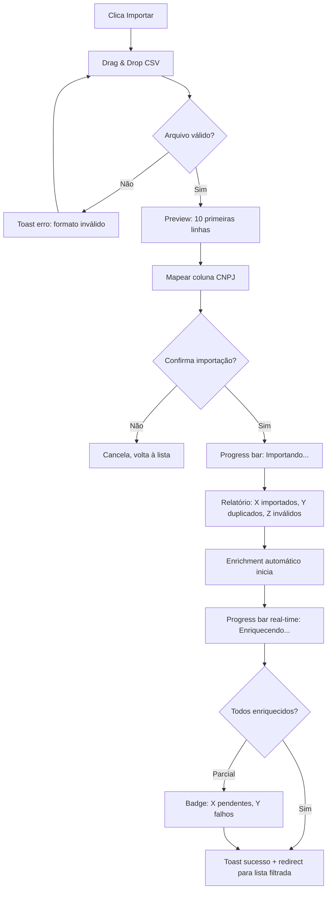
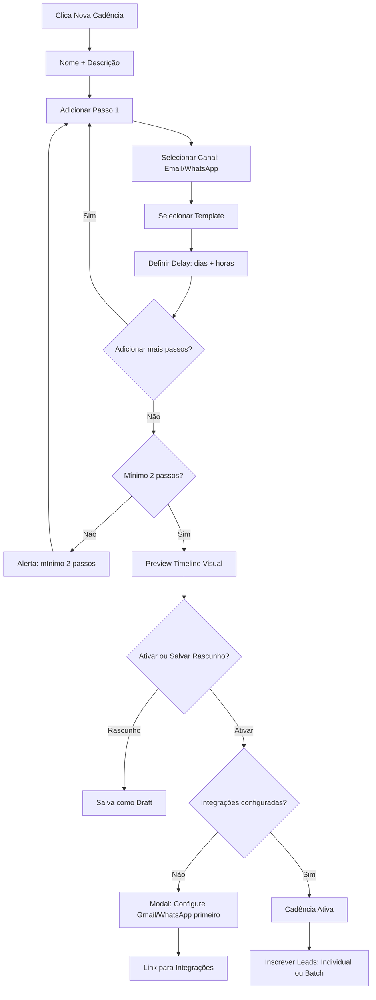
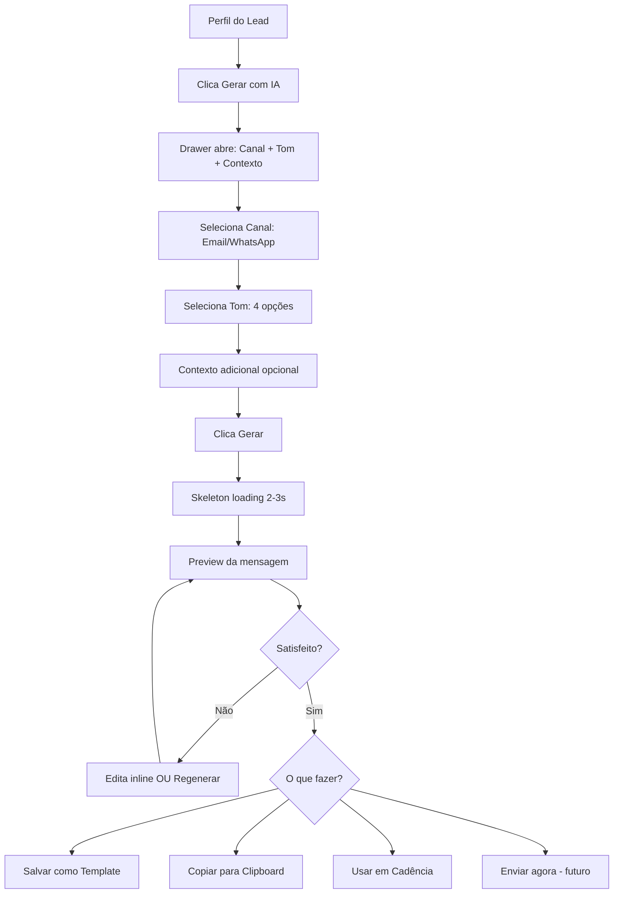
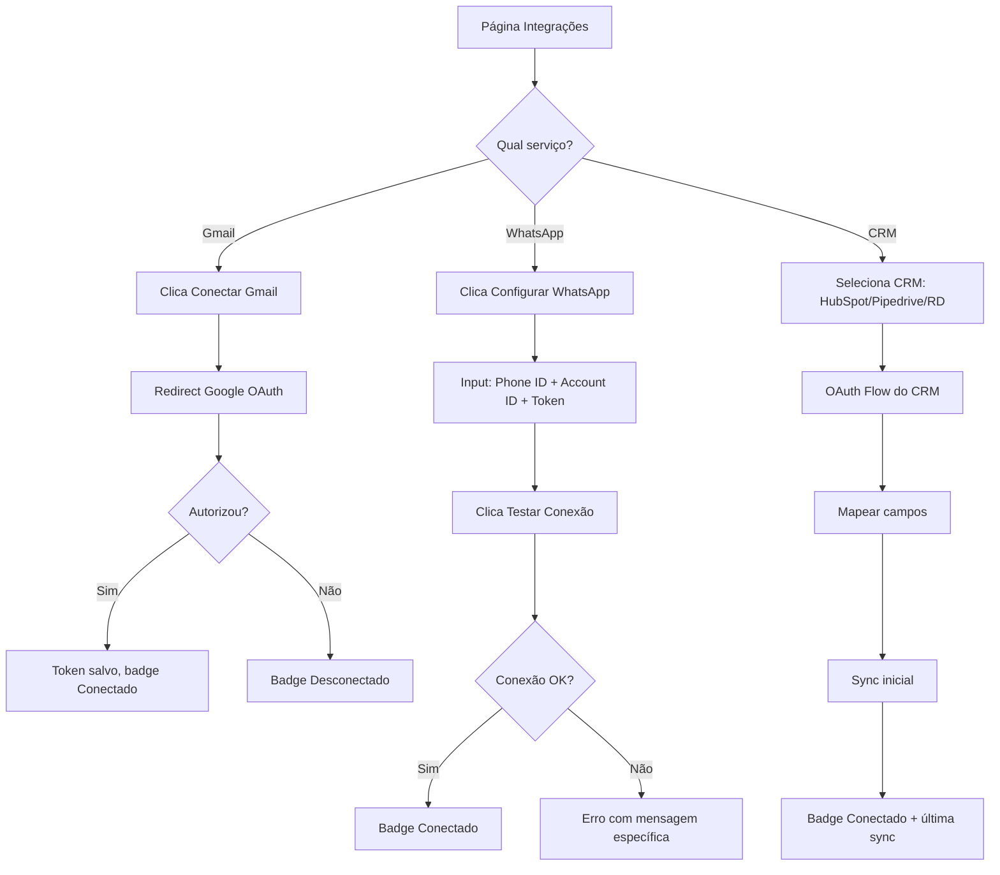

# Flux Sales Engagement 2.0 — UI/UX Specification

This document defines the user experience goals, information architecture, user flows, and visual design specifications for Flux Sales Engagement 2.0. It serves as the foundation for visual design and frontend development, ensuring a cohesive and user-centered experience.

---

## 1. Overall UX Goals & Principles

### 1.1 Target User Personas

**Persona 1 — Lucas, o SDR (Primary User)**
- **Perfil:** SDR/BDR em empresa B2B, 22-32 anos, tech-savvy
- **Rotina:** Prospecta 30-80 leads/dia via email e WhatsApp
- **Dor:** Perde 60% do tempo pesquisando dados e escrevendo mensagens manualmente
- **Goal:** Quer prospectar mais leads em menos tempo com mensagens relevantes
- **Contexto de uso:** Desktop (90%), mobile ocasional para checar respostas urgentes
- **Nível técnico:** Intermediário — confortável com SaaS, mas não quer complexidade

**Persona 2 — Carolina, a Gerente de Vendas (Secondary User)**
- **Perfil:** Head/Manager de vendas, 28-40 anos, orientada a dados
- **Rotina:** Acompanha métricas do time, define metas, ajusta processos
- **Dor:** Não tem visibilidade real sobre performance individual e pipeline
- **Goal:** Quer dashboards claros para tomar decisões rápidas e coaching data-driven
- **Contexto de uso:** Desktop (95%), revisão de métricas em reuniões via mobile
- **Nível técnico:** Intermediário-avançado — usa HubSpot/Pipedrive diariamente

### 1.2 Usability Goals

1. **Ease of learning:** Um SDR novo deve conseguir importar leads e criar uma cadência em menos de 10 minutos, sem treinamento
2. **Efficiency of use:** As 3 tarefas mais frequentes (verificar leads, revisar mensagens IA, checar respostas) devem ser acessíveis em no máximo 3 cliques a partir do dashboard
3. **Error prevention:** Ações destrutivas (arquivar lead, deletar cadência, desconectar CRM) sempre com confirmação modal
4. **Feedback imediato:** Toda ação do usuário tem resposta visual em menos de 200ms (skeleton, spinner, toast)
5. **Memorability:** SDRs que ficam 1 semana sem usar devem retomar sem reaprender

### 1.3 Design Principles

1. **Dados primeiro, decoração depois** — Cada pixel serve para informar ou para agir. Sem elementos decorativos que não transmitam informação
2. **Progressive disclosure** — Mostrar apenas o necessário no momento. Detalhes sob demanda (expandir, hover, drawer)
3. **Ação visível** — Botões de ação primária sempre visíveis e destacados. O SDR nunca deve se perguntar "o que faço agora?"
4. **Feedback constante** — Toasts para ações, badges para status, progress bars para processos longos (enrichment, cadência)
5. **Acessível por padrão** — WCAG AA integrado desde o design, não como remendo

### Change Log

| Date | Version | Description | Author |
|------|---------|-------------|--------|
| 2026-02-19 | 1.0 | Initial frontend spec from PRD v0.2 | Uma (UX) |

---

## 2. Information Architecture (IA)

### 2.1 Site Map / Screen Inventory

```mermaid
graph TD
    AUTH[Auth Pages] --> LOGIN[Login]
    AUTH --> SIGNUP[Signup]
    AUTH --> FORGOT[Forgot Password]

    APP[App Shell] --> DASH[Dashboard]
    APP --> LEADS[Leads]
    APP --> CAD[Cadences]
    APP --> TMPL[Templates]
    APP --> INTEG[Integrations]
    APP --> REPORT[Reports]
    APP --> SETTINGS[Settings]

    LEADS --> IMPORT[Import CSV]
    LEADS --> LIST[Lead List]
    LEADS --> PROFILE[Lead Profile]
    PROFILE --> TIMELINE[Activity Timeline]
    PROFILE --> AIGEN[AI Message Generator]

    CAD --> CADLIST[Cadence List]
    CAD --> BUILDER[Cadence Builder]
    CAD --> CADDETAIL[Cadence Detail/Metrics]

    TMPL --> TMPLLIST[Template List]
    TMPL --> TMPLEDIT[Template Editor]

    INTEG --> GMAIL[Gmail OAuth]
    INTEG --> WHATS[WhatsApp Config]
    INTEG --> CRM[CRM Connect]
    INTEG --> GCAL[Google Calendar]

    REPORT --> BYCAD[By Cadence]
    REPORT --> BYSDR[By SDR]
    REPORT --> GENERAL[General Funnel]

    SETTINGS --> ACCOUNT[Account/Org]
    SETTINGS --> USERS[User Management]
    SETTINGS --> BILLING[Billing & Plans]
```



### 2.2 Navigation Structure

**Primary Navigation (Sidebar):**

| Icon | Label | Route | Acesso |
|------|-------|-------|--------|
| LayoutDashboard | Dashboard | `/dashboard` | SDR + Manager |
| Users | Leads | `/leads` | SDR + Manager |
| Zap | Cadences | `/cadences` | SDR + Manager |
| FileText | Templates | `/templates` | SDR + Manager |
| Plug | Integrations | `/settings/integrations` | Manager |
| BarChart3 | Reports | `/reports` | Manager (SDR vê apenas seus dados) |
| Settings | Settings | `/settings` | SDR (perfil) + Manager (tudo) |

**Secondary Navigation:**
- Breadcrumbs em todas as páginas com profundidade > 1 (ex: Leads → Import, Leads → João Silva LTDA)
- Tabs dentro de páginas complexas (Reports: Por Cadência | Por SDR | Geral)
- Dropdown no header: Perfil, Configurações, Logout

**Breadcrumb Strategy:**
- Formato: `Home > Section > Subsection > Item`
- Clicável em todos os níveis
- Truncate nomes longos com ellipsis (max 30 chars por segmento)

---

## 3. User Flows

### 3.1 Flow: Importação e Enriquecimento de Leads

**User Goal:** Importar uma lista de CNPJs e ter os dados enriquecidos automaticamente
**Entry Points:** Sidebar → Leads → Botão "Importar" | Dashboard → CTA "Importar Leads"
**Success Criteria:** Leads importados, enriquecidos e visíveis na lista com dados completos



**Edge Cases:**
- CSV sem header → detectar automaticamente por padrão de CNPJ (14 dígitos)
- CSV com colunas extras → ignorar, importar apenas CNPJ
- CNPJ duplicado na mesma org → skip com contagem no relatório
- Rate limit da API de enrichment → queue e retry transparente
- Arquivo > 1.000 linhas → modal de aviso sobre limite do plano

---

### 3.2 Flow: Criação de Cadência

**User Goal:** Criar uma cadência linear de contato com passos de Email e WhatsApp
**Entry Points:** Sidebar → Cadences → Botão "Nova Cadência"
**Success Criteria:** Cadência criada com 2+ passos e pronta para inscrever leads



**Edge Cases:**
- Template selecionado usa canal não configurado → warning antes de ativar
- Edição de cadência ativa → precisa pausar primeiro
- Lead já inscrito na mesma cadência → bloquear com toast

---

### 3.3 Flow: Geração de Mensagem com IA

**User Goal:** Gerar uma mensagem personalizada para um lead específico usando IA
**Entry Points:** Lead Profile → Botão "Gerar com IA"
**Success Criteria:** Mensagem gerada, editada se necessário, e pronta para uso



**Edge Cases:**
- Rate limit de IA atingido → toast com contagem restante + sugestão de upgrade
- Lead sem dados enriquecidos → warning: "Enriqueça o lead primeiro para melhor personalização"
- Geração falha (timeout API) → retry automático 1x, depois botão manual

---

### 3.4 Flow: Conexão de Integrações

**User Goal:** Conectar Gmail, WhatsApp ou CRM à plataforma
**Entry Points:** Settings → Integrations | Modal de primeira vez ao tentar ativar cadência



---

## 4. Wireframes & Key Screen Layouts

**Design Tool:** Wireframes conceituais neste documento. Design detalhado a ser criado em Figma após aprovação.

### 4.1 Dashboard Principal

```
┌─────────────────────────────────────────────────────────────────┐
│ [Logo Flux]  Dashboard          🔔  Carolina ▾  [Org: Acme Co] │
├────────┬────────────────────────────────────────────────────────┤
│        │                                                        │
│ 📊     │  ┌──────────┐ ┌──────────┐ ┌──────────┐ ┌──────────┐ │
│ Dash   │  │ 1.234    │ │ 89%      │ │ 12       │ │ 156      │ │
│        │  │ Total    │ │ Enriched │ │ Cadences │ │ Msgs     │ │
│ 👥     │  │ Leads    │ │ Rate     │ │ Active   │ │ Sent/7d  │ │
│ Leads  │  └──────────┘ └──────────┘ └──────────┘ └──────────┘ │
│        │                                                        │
│ ⚡     │  ┌─────────────────────┐ ┌──────────────────────────┐ │
│ Cad.   │  │ Leads por Porte     │ │ Importações Recentes     │ │
│        │  │ ████████ Grande 12% │ │ 19/02 - leads.csv ✅ 98% │ │
│ 📝     │  │ ██████ Médio  18%   │ │ 18/02 - batch2.csv ✅ 95%│ │
│ Templ. │  │ ████████████ ME 45% │ │ 15/02 - cold.csv ⚠️ 87% │ │
│        │  │ ████ MEI     25%    │ │                          │ │
│ 🔌     │  └─────────────────────┘ └──────────────────────────┘ │
│ Integ. │                                                        │
│        │  ┌─────────────────────┐ ┌──────────────────────────┐ │
│ 📈     │  │ Leads por Estado    │ │ Ações Pendentes          │ │
│ Report │  │ [Mapa/Gráfico]      │ │ • 23 leads sem enrichment│ │
│        │  │                     │ │ • 5 respostas não lidas  │ │
│ ⚙️     │  │                     │ │ • 2 cadências pausadas   │ │
│ Config │  └─────────────────────┘ └──────────────────────────┘ │
│        │                                                        │
│ [<<]   │                         [Filtro: 7d | 30d | 90d | ⚙] │
└────────┴────────────────────────────────────────────────────────┘
```

**Interaction Notes:**
- Cards clicáveis — navega para a seção correspondente
- Sidebar colapsável com `[<<]` toggle (ícones only quando colapsada)
- Filtro de período persiste na sessão
- "Ações Pendentes" como checklist rápida com links diretos

---

### 4.2 Lista de Leads

```
┌─────────────────────────────────────────────────────────────────┐
│ Leads > Lista                                   [+ Importar]   │
├─────────────────────────────────────────────────────────────────┤
│ 🔍 Buscar por nome, CNPJ...    [Porte ▾] [Segmento ▾] [UF ▾] │
│                                  [Status ▾] [Enrichment ▾]     │
├─────────────────────────────────────────────────────────────────┤
│ ☐ │ Nome Fantasia    │ CNPJ       │ Porte │ UF │ Status │ Enr │
├───┼──────────────────┼────────────┼───────┼────┼────────┼─────┤
│ ☐ │ Acme Tech        │ 12.345.../│ ME    │ SP │ 🟢 New │ ✅  │
│ ☐ │ Beta Solutions   │ 23.456.../│ EPP   │ RJ │ 🔵 Cad │ ✅  │
│ ☐ │ Gamma Corp       │ 34.567.../│ Médio │ MG │ 🟢 New │ ⏳  │
│ ☐ │ Delta LTDA       │ 45.678.../│ MEI   │ PR │ 🔴 Arch│ ✅  │
├─────────────────────────────────────────────────────────────────┤
│ Selecionados: 2   [Enriquecer] [Inscrever em Cadência] [CSV]  │
├─────────────────────────────────────────────────────────────────┤
│ Mostrando 1-20 de 1.234        [< 1 2 3 ... 62 >]             │
└─────────────────────────────────────────────────────────────────┘
```

**Interaction Notes:**
- Checkbox para seleção múltipla com bulk action bar que aparece ao selecionar
- Filtros com query params na URL (compartilhável)
- Click na linha → abre Lead Profile
- Badges coloridos para status e enrichment
- Empty state: ilustração + CTA "Importe seu primeiro CSV"

---

### 4.3 Perfil do Lead

```
┌─────────────────────────────────────────────────────────────────┐
│ Leads > Acme Tech Soluções                                      │
├─────────────────────────────────────────────────────────────────┤
│                                                                  │
│  ACME TECH SOLUÇÕES LTDA          [🤖 Gerar com IA] [Editar]  │
│  CNPJ: 12.345.678/0001-90         [📅 Agendar]     [Arquivar] │
│  Status: 🟢 Novo  |  Enrichment: ✅ Completo                   │
│                                                                  │
│  ┌─── Dados da Empresa ──────────┐ ┌─── Contatos ───────────┐ │
│  │ Razão Social: Acme Tech Sol.. │ │ 📧 contato@acme.com.br │ │
│  │ Porte: ME                     │ │ 📱 (11) 99999-8888     │ │
│  │ CNAE: 6201-5 (Desenv. SW)    │ │                         │ │
│  │ Endereço: Av Paulista, 1000   │ │ 👤 Sócios:             │ │
│  │ Cidade: São Paulo/SP          │ │ • João Silva (CPF *123) │ │
│  │ Situação: Ativa               │ │ • Maria Santos (CPF *4) │ │
│  │ Faturamento: R$1.2M (est.)   │ │                         │ │
│  └───────────────────────────────┘ └─────────────────────────┘ │
│                                                                  │
│  ┌─── Timeline de Atividades ────────────────────────────────┐ │
│  │ 📧 19/02 10:30 — Email enviado (Cadência: Cold Outreach) │ │
│  │ 💬 17/02 14:00 — WhatsApp enviado (Cadência: Cold Out..) │ │
│  │ ✅ 15/02 09:00 — Lead enriquecido com sucesso             │ │
│  │ 📥 15/02 09:00 — Lead importado via batch-leads.csv       │ │
│  └───────────────────────────────────────────────────────────┘ │
└─────────────────────────────────────────────────────────────────┘
```

---

### 4.4 Cadence Builder

```
┌─────────────────────────────────────────────────────────────────┐
│ Cadências > Nova Cadência                        [Salvar Draft]│
├─────────────────────────────────────────────────────────────────┤
│ Nome: Cold Outreach Q1 2026                                     │
│ Descrição: Cadência para leads enriquecidos do segmento tech   │
├─────────────────────────────────────────────────────────────────┤
│                                                                  │
│  TIMELINE VISUAL                                                 │
│                                                                  │
│  ┌──────────┐     ┌──────────┐     ┌──────────┐                │
│  │ 📧 Dia 0 │────▶│ 💬 Dia 2 │────▶│ 📧 Dia 5 │   [+ Passo]  │
│  │ Email    │     │ WhatsApp │     │ Email    │                │
│  │ Template:│     │ Template:│     │ Template:│                │
│  │ Intro    │     │ Follow 1 │     │ Follow 2 │                │
│  │ 🤖 IA On │     │ 🤖 IA On │     │ 🤖 IA Off│                │
│  │ [✏️] [🗑] │     │ [✏️] [🗑] │     │ [✏️] [🗑] │                │
│  └──────────┘     └──────────┘     └──────────┘                │
│                                                                  │
│  ↕ Drag to reorder                                              │
│                                                                  │
├─────────────────────────────────────────────────────────────────┤
│ Resumo: 3 passos | 5 dias | 2 Email + 1 WhatsApp              │
│                                                                  │
│                              [Salvar Rascunho] [Ativar Cadência]│
└─────────────────────────────────────────────────────────────────┘
```

---

### 4.5 AI Message Generator (Drawer)

```
┌──────────────────────── AI Message Generator ───┐
│                                                  │
│  Lead: Acme Tech Soluções (ME, São Paulo)       │
│                                                  │
│  Canal:    [📧 Email]  [💬 WhatsApp]            │
│                                                  │
│  Tom:      [Profissional] [Consultivo]          │
│            [Direto]       [Amigável ✓]          │
│                                                  │
│  Contexto adicional (opcional):                  │
│  ┌──────────────────────────────────────────┐   │
│  │ Mencionar que vimos a empresa na ABCTech │   │
│  └──────────────────────────────────────────┘   │
│                                                  │
│            [🤖 Gerar Mensagem]                   │
│                                                  │
│  ─────────── Preview ──────────────              │
│  Assunto: Parceria para escalar vendas           │
│  ┌──────────────────────────────────────────┐   │
│  │ Olá João,                                │   │
│  │                                          │   │
│  │ Vi que a Acme Tech está crescendo no     │   │
│  │ segmento de desenvolvimento de software  │   │
│  │ em SP. Na ABCTech, ficamos impressionados│   │
│  │ com o trabalho de vocês.                 │   │
│  │                                          │   │
│  │ Temos ajudado empresas do porte da Acme  │   │
│  │ a escalar...                             │   │
│  │                                  [editar]│   │
│  └──────────────────────────────────────────┘   │
│                                                  │
│  [🔄 Regenerar] [💾 Salvar Template] [📋 Copiar]│
│                                                  │
│  Gerações hoje: 12/50    [Usar em Cadência →]   │
└──────────────────────────────────────────────────┘
```

---

## 5. Component Library / Design System

**Design System Approach:** shadcn/ui + Tailwind CSS como base. Componentes customizados construídos sobre os primitivos do shadcn seguindo Atomic Design.

### 5.1 Atoms

| Component | Variants | States | Usage |
|-----------|----------|--------|-------|
| **Button** | primary, secondary, ghost, destructive, outline | default, hover, active, disabled, loading | CTAs, ações, navegação |
| **Badge** | status (new, enriched, active, paused, failed, archived), channel (email, whatsapp) | default | Status labels, canal indicators |
| **Input** | text, email, password, search, textarea | default, focus, error, disabled | Formulários, busca |
| **Select** | single, multi | default, open, error, disabled | Filtros, seleções |
| **Toggle** | default | on, off, disabled | IA on/off, dark mode |
| **Avatar** | image, initials | default, online | User/org display |
| **Tooltip** | default | visible, hidden | Help contextual |
| **Skeleton** | line, card, table-row | loading | Loading states |
| **Toast** | success, error, warning, info | appear, dismiss | Feedback de ações |
| **Progress** | bar, circular | determinate, indeterminate | Enrichment, import |

### 5.2 Molecules

| Component | Composed Of | Usage |
|-----------|-------------|-------|
| **FormField** | Label + Input + ErrorMessage | Todos os formulários |
| **FilterChip** | Badge + CloseButton | Filtros ativos na lista de leads |
| **StatCard** | Icon + Number + Label + TrendIndicator | Dashboard metrics |
| **StepCard** | ChannelIcon + TemplatePreview + DelayBadge + AIToggle | Cadence builder steps |
| **TimelineItem** | Icon + Timestamp + Description + StatusBadge | Lead activity timeline |
| **IntegrationCard** | ServiceLogo + StatusBadge + ConnectButton | Integration settings |
| **LeadRow** | Checkbox + LeadName + CNPJ + Badges + Actions | Lead list table row |
| **TemplatePreview** | ChannelBadge + Subject + BodyPreview + Variables | Template list item |

### 5.3 Organisms

| Component | Usage |
|-----------|-------|
| **AppSidebar** | Navegação principal colapsável |
| **AppHeader** | User menu, org selector, notifications |
| **LeadTable** | Tabela completa com filtros, sort, pagination, bulk actions |
| **CadenceTimeline** | Visual builder de cadência com drag-and-drop |
| **AIGeneratorDrawer** | Painel lateral de geração de mensagem com IA |
| **ImportWizard** | Fluxo multi-step de importação CSV |
| **DashboardGrid** | Grid responsiva de StatCards e gráficos |
| **ReportChart** | Gráfico com filtro de período e export |

---

## 6. Branding & Style Guide

### 6.1 Color Palette

| Color Type | Hex Code | CSS Variable | Usage |
|-----------|----------|-------------|-------|
| **Primary** | `#6366F1` (Indigo 500) | `--primary` | Botões primários, links, foco |
| **Primary Dark** | `#4F46E5` (Indigo 600) | `--primary-dark` | Hover de botões primários |
| **Primary Light** | `#EEF2FF` (Indigo 50) | `--primary-light` | Backgrounds highlight |
| **Secondary** | `#8B5CF6` (Violet 500) | `--secondary` | Badges IA, acentos |
| **Accent** | `#06B6D4` (Cyan 500) | `--accent` | WhatsApp channel, destaques |
| **Success** | `#22C55E` (Green 500) | `--success` | Enriched, connected, pass |
| **Warning** | `#F59E0B` (Amber 500) | `--warning` | Pending, approaching limit |
| **Error** | `#EF4444` (Red 500) | `--error` | Failed, disconnected, error |
| **Neutral 50** | `#FAFAFA` | `--neutral-50` | Page background |
| **Neutral 100** | `#F4F4F5` | `--neutral-100` | Card background |
| **Neutral 200** | `#E4E4E7` | `--neutral-200` | Borders |
| **Neutral 500** | `#71717A` | `--neutral-500` | Secondary text |
| **Neutral 900** | `#18181B` | `--neutral-900` | Primary text |

**Dark Mode:** Todas as cores terão variante dark via CSS variables com `prefers-color-scheme` + toggle manual.

### 6.2 Typography

**Font Families:**
- **Primary:** Inter (Variable) — UI text, headings, body
- **Monospace:** JetBrains Mono — CNPJ display, code, dados técnicos

**Type Scale:**

| Element | Size | Weight | Line Height | Usage |
|---------|------|--------|------------|-------|
| H1 | 30px (1.875rem) | 700 (Bold) | 1.2 | Page titles |
| H2 | 24px (1.5rem) | 600 (Semibold) | 1.3 | Section headers |
| H3 | 20px (1.25rem) | 600 (Semibold) | 1.4 | Card titles |
| H4 | 16px (1rem) | 600 (Semibold) | 1.4 | Subsection headers |
| Body | 14px (0.875rem) | 400 (Regular) | 1.5 | Default text |
| Small | 12px (0.75rem) | 400 (Regular) | 1.5 | Captions, badges, timestamps |
| Mono | 13px (0.8125rem) | 400 (Regular) | 1.5 | CNPJ, dados técnicos |

### 6.3 Iconography

**Icon Library:** Lucide React (lucide-react)
- Style: Outline, 24x24 default, stroke-width 1.5
- Sizes: 16px (small/inline), 20px (buttons), 24px (navigation), 32px (empty states)
- Consistency: Um ícone por conceito em toda a aplicação

**Channel Icons:**
- 📧 Email → `Mail` (Lucide)
- 💬 WhatsApp → Custom SVG (logo oficial WhatsApp)
- 📞 Telefone → `Phone` (Lucide) — futuro
- 🤖 IA → `Sparkles` (Lucide)

### 6.4 Spacing & Layout

**Grid System:** CSS Grid + Flexbox via Tailwind
- Dashboard: 12-column grid, gap-6 (24px)
- Content max-width: 1280px (7xl)
- Sidebar: 256px expanded, 64px collapsed

**Spacing Scale (Tailwind default):**

| Token | Value | Usage |
|-------|-------|-------|
| `space-1` | 4px | Inline spacing, icon gaps |
| `space-2` | 8px | Tight groups, badge padding |
| `space-3` | 12px | Button padding horizontal |
| `space-4` | 16px | Card padding, form gaps |
| `space-6` | 24px | Section gaps, grid gaps |
| `space-8` | 32px | Page section spacing |
| `space-12` | 48px | Major section dividers |

**Border Radius:**
- Small: 6px (badges, chips)
- Default: 8px (buttons, inputs)
- Large: 12px (cards, modals)
- Full: 9999px (avatars, pills)

**Shadows:**
- `shadow-sm`: Cards, dropdowns
- `shadow-md`: Modals, drawers
- `shadow-lg`: Tooltips overlay

---

## 7. Accessibility Requirements

### 7.1 Compliance Target

**Standard:** WCAG 2.1 Level AA

### 7.2 Key Requirements

**Visual:**
- Color contrast: Mínimo 4.5:1 para texto normal, 3:1 para texto grande e componentes UI
- Focus indicators: Ring de 2px offset-2 em cor Primary (`focus-visible:ring-2 ring-indigo-500 ring-offset-2`)
- Text sizing: Base 14px, mínimo 12px, suporte a zoom até 200% sem quebra de layout

**Interaction:**
- Keyboard navigation: Todas as ações acessíveis via Tab + Enter/Space. Esc fecha modais/drawers
- Screen reader: ARIA labels em todos os ícones, live regions para toasts e progress, `role` adequado em tabelas e navegação
- Touch targets: Mínimo 44x44px em mobile, 32x32px em desktop

**Content:**
- Alt text: Imagens decorativas com `alt=""`, ícones com `aria-label`
- Heading structure: H1 → H2 → H3 sequencial, sem skip
- Form labels: Todos os inputs com `<label>` associado, erros com `aria-describedby`

### 7.3 Testing Strategy

- **Automated:** eslint-plugin-jsx-a11y no lint pipeline
- **Semi-automated:** axe-core via Playwright para E2E
- **Manual:** Teste de teclado nos fluxos críticos (import, cadence builder, AI generator)
- **Screen reader:** Teste com VoiceOver (macOS) nos 5 fluxos principais

---

## 8. Responsiveness Strategy

### 8.1 Breakpoints

| Breakpoint | Min Width | Max Width | Target Devices | Tailwind |
|-----------|-----------|-----------|---------------|----------|
| Mobile | 0px | 639px | Smartphones | `default` |
| Tablet | 640px | 1023px | Tablets, small laptops | `sm:` |
| Desktop | 1024px | 1279px | Laptops, desktops | `lg:` |
| Wide | 1280px | - | Wide monitors | `xl:` |

### 8.2 Adaptation Patterns

**Layout:**
- Mobile: Single column, sidebar vira bottom nav ou drawer
- Tablet: Two columns, sidebar collapsed by default
- Desktop: Full layout com sidebar expanded

**Navigation:**
- Mobile: Bottom navigation bar (5 items) + hamburger para mais
- Tablet: Sidebar collapsed (ícones only) + breadcrumbs
- Desktop: Sidebar expanded + breadcrumbs

**Content Priority (Mobile):**
- Dashboard: Apenas StatCards empilhados, gráficos scroll horizontal
- Lead List: Cards em vez de tabela, 1 lead por card
- Cadence Builder: Steps empilhados vertical, sem drag-and-drop (reorder via botões ↑↓)

**Interaction:**
- Mobile: Swipe para ações em cards (arquivar, enriquecer)
- Desktop: Hover states, right-click context menu (futuro)

---

## 9. Animation & Micro-interactions

### 9.1 Motion Principles

1. **Purposeful:** Toda animação comunica algo (estado, transição, feedback)
2. **Rápida:** Nenhuma animação > 300ms. Prefer 150-200ms
3. **Reduzível:** Respeitar `prefers-reduced-motion` — desabilitar todas as animações exceto feedback essencial
4. **Consistente:** Mesma easing function em toda a app

### 9.2 Key Animations

| Animation | Trigger | Duration | Easing | Description |
|-----------|---------|----------|--------|-------------|
| **Page transition** | Route change | 150ms | ease-out | Fade in content |
| **Sidebar collapse** | Toggle click | 200ms | ease-in-out | Width transition |
| **Toast appear** | Action feedback | 200ms | ease-out | Slide in from top-right |
| **Toast dismiss** | Auto/manual | 150ms | ease-in | Fade out |
| **Modal open** | Action trigger | 200ms | ease-out | Scale from 95% + fade |
| **Drawer open** | Action trigger | 250ms | ease-out | Slide from right |
| **Skeleton pulse** | Loading state | 1.5s loop | ease-in-out | Opacity pulse |
| **Progress bar** | Enrichment/import | Continuous | linear | Width growth |
| **Badge count** | New data | 150ms | ease-out | Scale bounce |
| **Drag reorder** | Cadence steps | Real-time | - | Follow cursor |

---

## 10. Performance Considerations

### 10.1 Performance Goals

| Metric | Target | Measurement |
|--------|--------|-------------|
| **LCP (Largest Contentful Paint)** | < 2.5s | Core Web Vitals |
| **FID (First Input Delay)** | < 100ms | Core Web Vitals |
| **CLS (Cumulative Layout Shift)** | < 0.1 | Core Web Vitals |
| **TTI (Time to Interactive)** | < 3.5s | Lighthouse |
| **Interaction Response** | < 200ms | User perception |
| **Animation FPS** | 60fps | Smooth visual |
| **Bundle size (initial)** | < 200KB gzipped | Network |

### 10.2 Design Strategies

- **Skeleton loaders** em vez de spinners para manter layout estável (CLS)
- **Server Components** (Next.js RSC) para conteúdo estático — reduz JS no client
- **Virtual scrolling** para listas > 100 items (lead list, templates)
- **Image optimization** via `next/image` para avatars e logos
- **Lazy loading** para gráficos do dashboard e reports (carrega ao entrar na viewport)
- **Optimistic updates** para ações rápidas (toggle, status change) — atualiza UI antes do server
- **React Query** com staleTime configurado por tipo de dado (leads: 30s, reports: 5min)

---

## 11. Next Steps

### Immediate Actions

1. Criar projeto no Figma com Design System baseado nesta spec (tokens, componentes, layouts)
2. Prototipar os 3 fluxos críticos: Import/Enrichment, Cadence Builder, AI Generator
3. Validar wireframes com 2-3 SDRs reais antes do desenvolvimento
4. Handoff para @architect para alinhar componentes com arquitetura frontend

### Design Handoff Checklist

- [x] All user flows documented (4 flows críticos)
- [x] Component inventory complete (10 atoms, 8 molecules, 8 organisms)
- [x] Accessibility requirements defined (WCAG AA)
- [x] Responsive strategy clear (4 breakpoints)
- [x] Brand guidelines defined (colors, typography, spacing, icons)
- [x] Performance goals established (Core Web Vitals targets)
- [x] Animation principles defined (9 key animations)
- [ ] Figma design system created (next step)
- [ ] User validation of wireframes (next step)

---

*— Uma, desenhando com empatia 💝*
